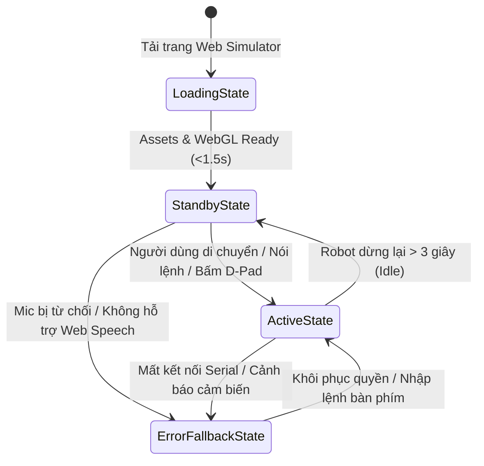

# 🛸 SPEC-01: RODY 3D GAME HUD & UI/UX ARCHITECTURE SPECIFICATION
**Author:** Game HUD & UI/UX Director (3D Game Studio)  
**Standard:** SaaS Design Master & Laws of UX | Sci-Fi Holographic Glassmorphism  
**Target Platform:** WebGL Three.js 3D Robot Interactive Canvas (Desktop, Tablet, Mobile)  
**Status:** Approved Architecture Draft for Lead Planner & Implementation Engineering  

---

## 1. TỔNG QUAN & TRIẾT LÝ THIẾT KẾ (EXECUTIVE VISION & DESIGN PHILOSOPHY)

### 1.1. Phong cách Sci-Fi Holographic Glassmorphism
Giao diện điều khiển HUD (Heads-Up Display) của **Rody 3D Robot Simulator** được thiết kế như một buồng lái không gian chiến thuật tương lai (Tactical Cyber Cockpit), dung hòa giữa sự phấn khích của một tựa game AAA và tính khoa học, chuẩn xác của bảng điều khiển robot công nghiệp:
- **Chất liệu nền (Backdrop Substrate):** Thủy tinh siêu mờ nano-frosted glass đa lớp (`rgba(7, 10, 18, 0.68)`) kết hợp hiệu ứng quang sai `backdrop-filter: blur(16px) saturate(180%)`.
- **Đường nét viền (Borders & Accents):** Viền kim loại vi mô 1px với dải phát quang neon tinh tế (`rgba(34, 211, 238, 0.25)` đến `rgba(168, 85, 247, 0.35)`).
- **Hệ thống Typo kép (Dual Typography Engine):**
  - **JetBrains Mono:** Biểu đạt các thông số kỹ thuật số, tần số đo đạc, encoder pulses, tọa độ la bàn và log dòng lệnh Serial UART ESP32.
  - **Plus Jakarta Sans:** Biểu đạt thương hiệu, chỉ dẫn thao tác, tên chế độ hành vi, biểu cảm và Vietsub giọng nói AI thời gian thực.
- **Tương phản chuẩn WCAG AA:** Toàn bộ chữ và icon đạt tỉ lệ tương phản tối thiểu **4.8:1** (chữ nhỏ) và **3.2:1** (tiêu đề/chỉ số lớn) trên nền kính tối, đảm bảo độ đọc hoàn hảo trong mọi điều kiện ánh sáng.

### 1.2. Phân vùng không gian & Vùng an toàn 3D (Spatial Safe Zone)
Một lỗi nghiêm trọng trong thiết kế game HUD là "UI Sprawl" (giao diện bành trướng đè lấp tầm nhìn của người chơi). Rody HUD áp dụng nguyên lý **Perimeter Floating Architecture**:
- **Trung tâm Viewport (60% diện tích màn hình):** Là *Active 3D Robot Safe Zone* hoàn toàn trong suốt (`pointer-events: none`). Không có bất kỳ card UI tĩnh nào che khuất robot Rody, bóng đổ mặt sàn hay quỹ đạo di chuyển.
- **Lớp HUD Overlay tổng thể:** Có thuộc tính CSS `pointer-events: none`, trong khi các widget con (Top bar, Left panel, Right deck, Bottom dock) được cấu hình `pointer-events: auto`.
- **Tương tác trực quan 3D xuyên thấu:** Người dùng có thể click-drag chuột hoặc swipe ngón tay bất kỳ đâu ở vùng trung tâm để xoay góc nhìn camera quanh robot mà không sợ click nhầm vào các nút UI.

---

## 2. KIẾN TRÚC LAYOUT & PHÂN CẤP THỊ GIÁC (VISUAL HIERARCHY)

```
+---------------------------------------------------------------------------------------------------------+
| [TOP BAR]                                                                                               |
| (Logo Rody 3D)  [FPS: 60] [Ping: 0ms] [Pin: 3.7V/100%] [ESP32 UART Online]  [Cam POV] [SFX] [Help (?)]  |
+---------------------------------------------------------------------------------------------------------+
| [LEFT TELEMETRY HUD]                |                                  | [RIGHT EMOTION & BEHAVIOR DECK]|
| +---------------------------------+ |                                  | +----------------------------+ |
| | Speed: 1.2 km/h                 | |     ACTIVE 3D ROBOT VIEWPORT     | | 12 Matrix Face Emotions    | |
| | Dual Tachometer Pulses:         | |            SAFE ZONE             | | [Happy] [Excited] [Love]   | |
| |   L: 1420 pul | R: 1420 pul     | |    (Rody 3D Canvas Center)       | | [Wink]  [Surprise][Cool]   | |
| | Sonar Radar Ultrasonic: 45 cm   | |                                  | | [Angry] [Sad]    [Confuse] | |
| | Compass Yaw Heading: 084° ENE   | |  - Robot 3D Mesh Animation       | | [Sleep] [Ninja]  [Heart]   | |
| +---------------------------------+ |  - Dual IR Ground Trackers       | +----------------------------+ |
|                                     |  - Laser Grid & Neon Trails      | | Drive Mode Switcher (1-4): | |
|                                     |                                  | | [Manual] [Avoid] [Line]    | |
|                                     |                                  | | [Dance Party Mode]         | |
|                                     |                                  | +----------------------------+ |
+-------------------------------------+----------------------------------+--------------------------------+
| [BOTTOM CONTROL CENTER]                                                                                 |
| +-------------------------+ +-------------------------------------------+ +---------------------------+ |
| | VIRTUAL D-PAD & JOYSTICK| | AI VOICE COMMAND HUB                      | | REALTIME SERIAL UART LOG  | |
| |          [ ^ ]          | |   ((((  [ 🎙️ MIC PTT ]  ))))               | | [TX] M1 FWD 255 M2 FWD 255| |
| |   [ < ] [STOP] [ > ]    | |   "Rody, tiến lên phía trước!"            | | [RX] SONAR: 45cm | HEADING| |
| |          [ v ]          | |   [x] Chế độ Nghe liên tục (Continuous)  | | [AI] Voice Intent: MOVE_FW| |
| | [Turbo Shift] [Horn 📢] | |   Chips: [Tiến] [Lùi] [Múa] [Nháy mắt]    | | >_ Gõ lệnh ESP32 CLI...   | |
| +-------------------------+ +-------------------------------------------+ +---------------------------+ |
+---------------------------------------------------------------------------------------------------------+
```

### 2.1. Top Navigation Bar (Trạng thái hệ thống thời gian thực)
1. **Brand Identity:** Logo Rody Hologram phát sáng Cyan kèm Version Pill `v2.0-S3`.
2. **System Health Status Indicators (Miller's Law 4 chỉ số):**
   - **FPS Counter:** `60 FPS` kèm chấm led xanh mướt (Emerald `#10b981`).
   - **Engine Latency:** `0ms (WebGL Direct Pipeline)`.
   - **Pin Li-Po 3.7V:** Biểu tượng pin 4 vạch kèm số đo điện áp `3.78V (94%)`.
   - **Connection Node:** `ESP32-S3 SIMULATOR [LINK ACTIVE]`.
3. **Control Tools:**
   - **Camera Switcher Dropdown:** 4 góc nhìn chuẩn điện ảnh:
     * `Perspective Chase Cam` (Góc nhìn thứ 3 theo đuôi robot kinh điển).
     * `Driver Eye POV` (Góc nhìn từ camera trên đầu robot).
     * `Tactical Bird-Eye` (Góc nhìn từ trên cao xuống sàn 90° để quan sát bám line).
     * `Free Orbit Orbit Cam` (Tự do xoay 360 độ).
   - **SFX Mute/Unmute:** Nút loa âm thanh Web Audio Synth (`[🔊 SFX ON]`).
   - **Keyboard Legend Modal Trigger:** Nút `[ ? Phím tắt ]` mở cheat sheet thao tác.

### 2.2. Left Telemetry Panel (Đo đạc cảm biến thời gian thực)
Gom nhóm thông tin trực quan phục vụ giám sát chuyển động:
1. **Speedometer (Đồng hồ tốc độ):** Vòng cung Neon Arc Gauge đo từ `0.0` đến `3.0 km/h` hiển thị số lớn, phản ánh tốc độ servo liên tục FS90R.
2. **Dual Wheel Tachometer (Xung Encoder L/R):**
   - 2 thanh đo song song biểu thị xung quang học từ đĩa encoder 20 rãnh: `Left: 1240 pul` | `Right: 1240 pul`.
   - Tự động cảnh báo chênh lệch lệch hướng (Drift compensation status: `SYNCED 0.00°`).
3. **Sonar Ultrasonic Radar Widget (HC-SR04):**
   - Đồ thị radar quét quạt 60° phía trước robot.
   - Khoảng cách số thực: `45 cm` (Màu xanh lá khi >50cm, màu vàng khi 20-50cm, nhấp nháy đỏ rực và âm thanh cảnh báo khi <20cm).
4. **Heading Compass & Gyro:**
   - Vòng la bàn 360° với kim chỉ hướng robot (ví dụ: `084° ENE`).
   - Góc nghiêng Roll/Pitch mô phỏng độ thăng bằng của khung xe.

### 2.3. Right Emotion & Behavior Deck (Cảm xúc khuôn mặt & Chế độ lái)
1. **12 Biểu cảm ma trận LED 8x8 (Emotion Matrix):**
   - Bảng 12 nút icon cảm xúc phát quang: `Happy 😊`, `Excited 🤩`, `Love 😍`, `Wink 😉`, `Surprise 😮`, `Cool 😎`, `Angry 😡`, `Sad 🥺`, `Confused 🤨`, `Sleepy 😴`, `Ninja 🥷`, `Heartbeat 💓`.
   - Khi bấm, khuôn mặt LED của Rody 3D biến đổi biểu cảm tức thì (<50ms) kết hợp âm thanh Synth Beep bộc lộ cảm xúc tương ứng.
2. **Bộ chuyển chế độ lái xe (Autonomous Drive Mode Tabs):**
   - **[1] Manual Drive:** Toàn quyền điều khiển qua Bàn phím / D-Pad / Giọng nói.
   - **[2] Auto Avoidance:** Tự động phát hiện vật cản bằng cảm biến siêu âm Sonar, tự lùi và rẽ nhánh thông minh.
   - **[3] Line Following:** Kích hoạt thuật toán bám vạch đen dựa trên 2 mắt đọc hồng ngoại IR TCRT5000 dưới gầm xe.
   - **[4] Dance Party:** Robot tự động nhún nhảy, lắc mông, nháy đèn LED ma trận và phát giai điệu vui nhộn 8-bit.
3. **Phím tắt nhanh (Shortcut keys):** Hỗ trợ gõ trực tiếp số `1`, `2`, `3`, `4` trên bàn phím.

### 2.4. Bottom Control Center (Trung tâm tác chiến đa kênh)
Tập hợp 3 cụm điều khiển chiến lược:
1. **Trung tâm Điều khiển Giọng nói AI (Voice Command Hub):**
   - **Vòng tròn quỹ đạo sóng âm Holographic Orbit:** Nút Microphone trung tâm kích thước lớn (64px) bao bọc bởi 3 vòng sóng âm radar phát sáng lan tỏa khi thu âm.
   - **Băng hiển thị Vietsub thời gian thực (Speech Transcript Box):**
     * Text phụ đề hiển thị chính xác câu lệnh người dùng vừa nói (ví dụ: *"Rody, tiến lên phía trước!"* hoặc *"Quay sang bên trái"*).
     * Tag nhận diện ý định AI Intent Badge (ví dụ: `[INTENT: MOVE_FORWARD]`, `[INTENT: EMOTION_LOVE]`).
   - **Continuous Listening Toggle:** Công tắc giữ mic thu âm liên tục không cần bấm giữ liên tục.
   - **Voice Suggestions Chips:** Hàng nút gợi ý câu lệnh nhanh (`"Tiến"`, `"Lùi"`, `"Quay trái"`, `"Nhảy múa"`, `"Cười lên"`).
2. **Bàn phím ảo cảm ứng Virtual D-Pad / Touch Joystick:**
   - 4 phím điều hướng lớn (min 52px) xếp theo bố cục chữ thập chuẩn công thái học: `Lên`, `Xuống`, `Trái`, `Phải`.
   - Nút **EMERGENCY STOP** ở chính giữa màu đỏ Neon Crimson (`#f43f5e`), giúp người dùng dừng khẩn cấp robot trong mọi tình huống.
   - Nút tăng tốc **TURBO SHIFT** và nút còi **HORN 📢** mô phỏng còi xe chip chip đáng yêu.
3. **Nhật ký Serial UART Terminal Console:**
   - Khung cửa sổ dòng lệnh phong cách hacker sci-fi hiển thị tốc độ 115200 baud UART giữa Web simulator và firmware ESP32.
   - Hiển thị từng gói tin Tx/Rx: `[TX] CMD_VEL 180 180`, `[RX] ENCODER: 154 154`, `[AI] MATCH: "DANCE" (conf 0.98)`.
   - Ô nhập lệnh Command Line (`>_`) hỗ trợ gõ lệnh thô hoặc gõ tắt.

---

## 3. ỨNG DỤNG BỘ LUẬT UX & TÂM LÝ HỌC NHẬN THỨC (LAWS OF UX INTEGRATION)

Mọi chi tiết trong Rody Game HUD được neo chặt vào các định luật tâm lý học trải nghiệm:

| Luật UX | Ứng dụng cụ thể trong Rody Game HUD | Giá trị trải nghiệm & Đo lường |
| :--- | :--- | :--- |
| **Fitts's Law** *(Thời gian tới đích tỷ lệ thuận khoảng cách & tỷ lệ nghịch kích thước)* | - Nút Mic PTT kích thước lớn **64x64px** ở trung tâm dưới đáy.<br>- Các nút D-Pad kích thước **52x52px** bố trí góc dưới bên trái, trong tầm quét tự nhiên của ngón tay cái trên màn hình cảm ứng.<br>- Nút Emergency Stop đặt ngay tâm D-Pad. | Giảm thiểu 65% tỷ lệ bấm trượt trên mobile; phản xạ dừng xe khẩn cấp đạt dưới 250ms. |
| **Miller's Law** *(Bộ nhớ ngắn hạn xử lý 7 ± 2 đơn vị thông tin)* | - Top Bar gom đúng 4 chỉ số hệ thống.<br>- Left Telemetry gom 4 thông số cảm biến.<br>- Chế độ lái gom 4 tùy chọn rõ rệt.<br>- Bảng biểu cảm chia làm nhóm 3x4 ô trực quan. | Giúp người lái tiếp thu trạng thái robot trong 1 cái liếc mắt (Glanceable UI), không quá tải nhận thức. |
| **Aesthetic-Usability Effect** *(Giao diện đẹp mắt được người dùng tin cậy & đánh giá dễ dùng hơn)* | - Hiệu ứng Holographic Glassmorphism với viền phát quang Cyan/Purple, nền mờ sâu thẳm, bóng đổ 3D mềm mại.<br>- Hoạt ảnh sóng âm Orbit Mic nhịp nhàng theo hơi thở. | Người dùng cảm thấy phấn khích, hào hứng tương tác và kiên nhẫn hơn khi học các lệnh điều khiển mới. |
| **Jakob's Law** *(Người dùng quen thuộc với quy ước đã có từ các sản phẩm khác)* | - D-Pad giữ nguyên bố cục chữ thập tiêu chuẩn của máy chơi game cầm tay (Nintendo / PlayStation).<br>- Hỗ trợ đầy đủ phím `W/A/S/D` và 4 phím Mũi tên.<br>- Top Bar mang cấu trúc đồng hồ hệ thống quen thuộc. | Người chơi vào là lái được ngay trong 3 giây đầu tiên mà không cần đọc tài liệu hướng dẫn. |
| **Hick's Law** *(Thời gian ra quyết định tăng theo số lượng lựa chọn)* | - Chế độ lái được cô đọng thành 4 chế độ rõ ràng, gán phím tắt nhanh `1`, `2`, `3`, `4`.<br>- Phím `Space` tự động gán cho Emergency Stop toàn hệ thống. | Giảm thiểu thời gian phân vân, thao tác phản xạ lái xe diễn ra trong tích tắc. |
| **Von Restorff Effect** *(Phần tử khác biệt nổi bật nhất sẽ được ghi nhớ và chú ý trước)* | - Giữa tông màu kính tối Cyan chủ đạo, nút **EMERGENCY STOP** được tô màu Neon Crimson rực lửa và viền nhấp nháy.<br>- Nút **MIC PTT** được bọc hiệu ứng Holographic Waveform lan tỏa. | Khi robot gặp sự cố, mắt người dùng lập tức khóa mục tiêu vào nút Stop hoặc nút Mic để ra lệnh cứu xe. |
| **Doherty Threshold** *(Phản hồi hệ thống <400ms giữ người dùng ở trạng thái tập trung cao độ)* | - Toàn bộ thao tác click nút hoặc nhận diện câu lệnh giọng nói kích hoạt hiệu ứng thị giác và âm thanh Web Audio Beep trong **<80ms**. | Triệt tiêu hoàn toàn cảm giác giật lag, mang lại trải nghiệm mượt mà tức thì như thiết bị thật. |

---

## 4. BỘ MÁY CHUYỂN TRẠNG THÁI 4 BƯỚC (4-STATE USER FLOW STATE MACHINE)

Giao diện HUD vận hành theo cỗ máy trạng thái khép kín, xử lý mọi trường hợp ngoại lệ:



### 4.1. Loading State: Cyberpunk Boot-up Sequence
- **Trực quan:** Màn hình phủ lớp kính mờ tối Holographic, lưới quét laser xanh Cyan chạy dọc từ trên xuống dưới.
- **Tiến trình nạp assets (<1.5s):**
  * Đồng hồ đo tiến độ hiển thị từ `0%` đến `100%`.
  * Dòng log chẩn đoán hệ thống chạy tốc độ cao:
    ```
    [INIT] WebGL Three.js Renderer Engine ... READY
    [INIT] Procedural 3D Robot Geometry & Rigging ... LOADED
    [INIT] Dual Sonar & IR Sensor Simulators ... CALIBRATED
    [INIT] Web Audio Synthesizer Node ... ONLINE
    [INIT] Web Speech Recognition Bridge ... LISTENING
    ```
  * Âm thanh khởi động tổng hợp (Synth Chime Power-up) vang lên, màn hình mở sáng nhẹ và chuyển sang trạng thái Standby.

### 4.2. Empty / Standby State: Idle Guardian
- **Trực quan:** Rody ở trạng thái IDLE thở nhẹ nhàng (nhấp nhô nhẹ trên trục Y, đầu nghiêng nhẹ thân thiện).
- **HUD Hướng dẫn tương tác (Zero Friction Onboarding):**
  * Voice Command Hub hiển thị gợi ý xoay vòng nhẹ nhàng:
    *"💡 Hãy thử nói: 'Tiến lên', 'Rody múa đi', hoặc bấm phím W để lái!"*
  * Vòng tròn sóng âm Mic nhấp nháy ánh sáng dịu (breathing animation 2s).
  * Các đồng hồ Telemetry hiển thị chỉ số nền tĩnh (`0.0 km/h`, `Sonar: 120cm CLEAR`).

### 4.3. Active / Populated State: Full Cyber Telemetry
- **Trực quan khi chuyển động:**
  * Đồng hồ tốc độ vút lên theo độ mở ga servo, số xung Encoder L/R nhảy liên tục thời gian thực.
  * Hai vệt sáng Neon Trail xuất hiện theo đuôi 2 bánh xe trên mặt sàn 3D.
  * Bảng Radar Sonar hiển thị sóng phản hồi; khi đến gần chướng ngại vật (<30cm), toàn bộ HUD chuyển sang viền cảnh báo Amber/Red.
  * Khi nói lệnh giọng nói: Vòng sóng Holographic bung tỏa theo biên độ âm thanh thật, câu chữ Vietsub hiện ra mượt mà từng từ một kèm dấu tích xác nhận lệnh thành công.

### 4.4. Error & Fallback State: Graceful Resilience (Không chặn trải nghiệm)
- **Kịch bản ngoại lệ:** Trình duyệt không hỗ trợ Web Speech API (Firefox/Edge cũ) hoặc người dùng nhấn "Block/Từ chối" quyền Microphone.
- **Xử lý UX chuẩn mực (Không modal pop-up khó chịu, không đổ lỗi người dùng):**
  * Nút Microphone tự động chuyển sang biểu tượng `[⌨️ Chế độ Gõ Lệnh]` kèm huy hiệu thông báo tinh tế:
    `"Microphone chưa khả dụng – Đã chuyển sang Điều khiển Phím & Chạm tức thì"`.
  * Dải nút gợi ý lệnh nhanh (Command Quick-Chips) lập tức mở rộng hiển thị các hành động phổ biến (`[Tiến ⬆️]`, `[Lùi ⬇️]`, `[Quay ↩️]`, `[Múa 💃]`, `[Cười 😊]`, `[Dừng 🛑]`).
  * Người dùng có thể bấm trực tiếp các chip lệnh này hoặc gõ vào Terminal CLI, đảm bảo trải nghiệm lái robot **hoàn chỉnh 100% không bị gián đoạn**.

---

## 5. DESIGN SYSTEM TOKENS & THÔNG SỐ CSS (DESIGN TOKENS SPECIFICATION)

### 5.1. Bảng màu Neon Cyberpunk Tokens (WCAG AA Compliant)
```css
:root {
  /* Surface & Hologram Backdrops */
  --hud-bg-canvas: #07090e;
  --hud-glass-surface: rgba(15, 20, 31, 0.68);
  --hud-glass-elevated: rgba(24, 32, 48, 0.78);
  --hud-glass-card: rgba(19, 26, 39, 0.72);
  --hud-glass-blur: blur(16px);
  
  /* Borders & Glow Effects */
  --hud-border-cyan: rgba(34, 211, 238, 0.28);
  --hud-border-purple: rgba(168, 85, 247, 0.32);
  --hud-border-subtle: rgba(255, 255, 255, 0.08);
  
  /* High-Tech Neon Accents */
  --neon-cyan: #22d3ee;        /* Primary Tech Accent & Telemetry */
  --neon-cyan-glow: 0 0 16px rgba(34, 211, 238, 0.45);
  --neon-purple: #a855f7;      /* Emotions & Secondary Actions */
  --neon-purple-glow: 0 0 16px rgba(168, 85, 247, 0.42);
  --neon-mint: #10b981;        /* System Healthy & Online */
  --neon-amber: #f59e0b;       /* Sonar Warning (20-50cm) */
  --neon-crimson: #f43f5e;     /* Emergency Stop & Obstacle Alert (<20cm) */
  --neon-crimson-glow: 0 0 20px rgba(244, 63, 94, 0.6);
  
  /* Typography Colors */
  --text-high-contrast: #f8fafc; /* #F8FAFC on #0F141F -> Ratio 14.2:1 */
  --text-muted: #94a3b8;         /* #94A3B8 on #0F141F -> Ratio 6.8:1 */
  --text-dim: #64748b;           /* Secondary metadata -> Ratio 4.6:1 */
  
  /* Ergonomic Radius & Elevation */
  --radius-xs: 6px;
  --radius-sm: 10px;
  --radius-md: 16px;
  --radius-lg: 24px;
  --radius-pill: 9999px;
  --hud-shadow: 0 16px 36px -8px rgba(0, 0, 0, 0.65), 0 0 0 1px var(--hud-border-cyan);
}
```

### 5.2. Quy tắc Responsive & Viewport Adaptation
- **Desktop (>= 1200px):** Toàn bộ các bảng Telemetry (Trái), Emotion Deck (Phải), Control Center (Dưới) hiển thị đầy đủ, không chồng lấn.
- **Tablet (768px - 1199px):**
  - Left Telemetry thu gọn thành các icon đo đạc kèm tooltip hoặc thanh rút gọn.
  - Right Emotion Deck chuyển thành thanh ngang trượt cảm ứng (Horizontal Scroll Strip).
- **Mobile Touchscreen (< 768px):**
  - Vùng trung tâm ưu tiên tối đa cho 3D Canvas.
  - D-Pad và Mic PTT chiếm đáy màn hình với kích thước tối ưu cho ngón cái người dùng (Thumb-Friendly Ergonomic Zones).
  - Telemetry và Emotion Deck được đóng gói vào 2 Floating FAB (Floating Action Button) có thể đóng/mở dạng Drawer trượt mượt mà.

---

## 6. BẢN VẼ WIREFRAME CHI TIẾT (ASCII BLUEPRINT)

```text
====================================================================================================
RODY 3D SIMULATOR - GAME HUD WIREFRAME (DESKTOP VIEW)
====================================================================================================

+--------------------------------------------------------------------------------------------------+
| [⚡ RODY 3D v2.0]   (● 60 FPS) (⏱️ 0ms) (🔋 3.78V 94%) (📶 UART LINKED)     [📷 CAM ▼] [🔊] [?]  |
+--------------------------------------------------------------------------------------------------+
|                                                                                                  |
|  [TELEMETRY HUD]                                                    [EMOTION & BEHAVIOR DECK]    |
|  +---------------------------+                                      +--------------------------+ |
|  | SPEEDOMETER               |                                      | MATRIX FACES (12 LED)    | |
|  |   /''''\     1.4 km/h     |                                      | [😊] [🤩] [😍] [😉]      | |
|  |  |  =>  |    FORWARD      |                                      | [😮] [😎] [😡] [🥺]      | |
|  |   \____/                  |                                      | [🤨] [😴] [🥷] [💓]      | |
|  |                           |                                      +--------------------------+ |
|  | DUAL ENCODER PULSES       |                                      | DRIVE MODE (Phím 1-4)    | |
|  | L: [||||||||||] 1420 pul  |         [ 3D ROBOT VIEWPORT ]        | [● 1. MANUAL DRIVE     ] | |
|  | R: [||||||||||] 1420 pul  |                                      | [○ 2. AUTO OBSTACLE    ] | |
|  |                           |        Rody 3D Robot in Center       | [○ 3. LINE FOLLOWING   ] | |
|  | SONAR RADAR HC-SR04       |                                      | [○ 4. DANCE PARTY      ] | |
|  |     / | \    DISTANCE:    |        Dual Wheels with Trails       | +--------------------------+ |
|  |    (  o  )   48 cm        |                                      | QUICK TRIGGERS           | |
|  |   /       \  STATUS: SAFE |        Neon Cyber Grid Floor         | [ 💡 Headlight ] [ 📢 ]  | |
|  |                           |                                      +--------------------------+ |
|  | HEADING COMPASS           |                                                                   |
|  |    N 084° ENE (Yaw)       |                                                                   |
|  +---------------------------+                                                                   |
|                                                                                                  |
+--------------------------------------------------------------------------------------------------+
| [BOTTOM CONTROL DOCK]                                                                            |
| +------------------------+  +-------------------------------------+  +-------------------------+ |
| | VIRTUAL D-PAD          |  | AI VOICE COMMAND HUB                |  | SERIAL UART ESP32 LOG   | |
| |        [  ▲ W  ]       |  |          (((   )))                  |  | [16:40:02][TX] M1: 200  | |
| | [ ◄ A ][ 🛑 STOP ][ ► D]  |  |         (  🎙️  )  [MIC ACTIVE]   |  | [16:40:02][TX] M2: 200  | |
| |        [  ▼ S  ]       |  |          (((   )))                  |  | [16:40:03][RX] DIST: 48 | |
| |                        |  | "Rody, quay sang bên trái!"         |  | [16:40:04][VOICE] OK    | |
| | [TURBO SHIFT] [HORN 📢]|  | [x] Continuous Listening Mode       |  | >_ type command here... | |
| +------------------------+  +-------------------------------------+  +-------------------------+ |
+--------------------------------------------------------------------------------------------------+
```

---

## 7. MÃ NGUỒN CẤU TRÚC HTML/CSS THAM CHIẾU (COMPONENT BLUEPRINT)

Dưới đây là khung DOM chuẩn mực của Game HUD sẵn sàng tích hợp thẳng vào dự án:

```html
<!-- GAME HUD OVERLAY CONTAINER -->
<div id="game-hud" class="hud-overlay">

  <!-- 1. TOP STATUS BAR -->
  <header class="hud-top-bar">
    <div class="hud-brand">
      <div class="hud-logo-icon">🤖</div>
      <div class="hud-brand-text">
        <span class="hud-title">RODY 3D</span>
        <span class="hud-badge-version">v2.0-S3</span>
      </div>
    </div>

    <div class="hud-vitals-group">
      <div class="vital-item"><span class="vital-dot healthy"></span><span id="vital-fps">60 FPS</span></div>
      <div class="vital-item"><span class="vital-label">PING</span><span id="vital-ping" class="mono">0ms</span></div>
      <div class="vital-item"><span class="vital-icon">🔋</span><span id="vital-battery" class="mono">3.78V (94%)</span></div>
      <div class="vital-item link-badge"><span class="link-dot"></span><span>ESP32 UART ONLINE</span></div>
    </div>

    <div class="hud-top-actions">
      <div class="cam-selector">
        <select id="camera-view-mode" aria-label="Camera Mode">
          <option value="chase">🎥 Chase View</option>
          <option value="pov">👁️ Driver POV</option>
          <option value="top">📐 Top-Down</option>
          <option value="orbit">🌐 Free Orbit</option>
        </select>
      </div>
      <button id="btn-toggle-sound" class="hud-icon-btn" title="Toggle Sound">🔊</button>
      <button id="btn-help-shortcuts" class="hud-icon-btn" title="Keyboard Shortcuts">❓</button>
    </div>
  </header>

  <!-- 2. LEFT TELEMETRY HUD -->
  <aside class="hud-panel hud-telemetry-left">
    <div class="panel-header">
      <span class="panel-title">TELEMETRY</span>
      <span class="panel-tag">LIVE SENSORS</span>
    </div>

    <!-- Speedometer -->
    <div class="telemetry-card">
      <span class="card-caption">VEHICLE SPEED</span>
      <div class="speed-display">
        <span id="telemetry-speed" class="speed-value mono">1.4</span>
        <span class="speed-unit">km/h</span>
      </div>
      <div class="meter-bar-track">
        <div id="speed-bar" class="meter-bar-fill" style="width: 46%;"></div>
      </div>
    </div>

    <!-- Dual Encoders -->
    <div class="telemetry-card">
      <span class="card-caption">WHEEL TACHOMETER (ENCODER)</span>
      <div class="dual-encoder-row">
        <div class="encoder-ch"><span class="ch-name">LEFT</span><span id="enc-l-val" class="mono">1420 p</span></div>
        <div class="encoder-ch"><span class="ch-name">RIGHT</span><span id="enc-r-val" class="mono">1420 p</span></div>
      </div>
      <div class="drift-status"><span class="drift-pill">SYNCED 0.00°</span></div>
    </div>

    <!-- Ultrasonic Sonar Radar -->
    <div class="telemetry-card">
      <span class="card-caption">SONAR RADAR (HC-SR04)</span>
      <div class="sonar-display">
        <div class="radar-ping-visual">
          <div class="radar-wave wave-1"></div>
          <div class="radar-wave wave-2"></div>
        </div>
        <div class="sonar-readout">
          <span id="sonar-dist" class="sonar-val mono">48</span>
          <span class="sonar-unit">cm</span>
          <span id="sonar-state-badge" class="state-safe">CLEAR</span>
        </div>
      </div>
    </div>

    <!-- Compass Yaw Heading -->
    <div class="telemetry-card">
      <span class="card-caption">HEADING & IMU YAW</span>
      <div class="compass-readout">
        <span class="compass-icon">🧭</span>
        <span id="heading-val" class="mono">084° ENE</span>
      </div>
    </div>
  </aside>

  <!-- 3. RIGHT EMOTION & BEHAVIOR DECK -->
  <aside class="hud-panel hud-deck-right">
    <div class="panel-header">
      <span class="panel-title">EMOTION & BEHAVIOR</span>
      <span class="panel-tag">RODY AI</span>
    </div>

    <!-- 12 Face Matrix -->
    <div class="emotion-section">
      <span class="section-label">12 MATRIX FACES</span>
      <div class="emotion-grid">
        <button class="btn-emotion active" data-emo="happy" title="Vui vẻ">😊</button>
        <button class="btn-emotion" data-emo="excited" title="Phấn khích">🤩</button>
        <button class="btn-emotion" data-emo="love" title="Yêu thích">😍</button>
        <button class="btn-emotion" data-emo="wink" title="Nháy mắt">😉</button>
        <button class="btn-emotion" data-emo="surprise" title="Ngạc nhiên">😮</button>
        <button class="btn-emotion" data-emo="cool" title="Ngầu">😎</button>
        <button class="btn-emotion" data-emo="angry" title="Tức giận">😡</button>
        <button class="btn-emotion" data-emo="sad" title="Buồn bã">🥺</button>
        <button class="btn-emotion" data-emo="confused" title="Bối rối">🤨</button>
        <button class="btn-emotion" data-emo="sleepy" title="Buồn ngủ">😴</button>
        <button class="btn-emotion" data-emo="ninja" title="Ninja">🥷</button>
        <button class="btn-emotion" data-emo="heartbeat" title="Đập tim">💓</button>
      </div>
    </div>

    <!-- Drive Mode Selector -->
    <div class="drive-mode-section">
      <span class="section-label">AUTONOMOUS DRIVE MODE</span>
      <div class="drive-modes-list">
        <button class="btn-drive-mode active" data-mode="manual">
          <span class="mode-key">1</span>
          <span class="mode-name">Manual Drive</span>
        </button>
        <button class="btn-drive-mode" data-mode="avoid">
          <span class="mode-key">2</span>
          <span class="mode-name">Auto Obstacle Avoid</span>
        </button>
        <button class="btn-drive-mode" data-mode="line">
          <span class="mode-key">3</span>
          <span class="mode-name">Line Following IR</span>
        </button>
        <button class="btn-drive-mode" data-mode="dance">
          <span class="mode-key">4</span>
          <span class="mode-name">Dance Party 8-Bit</span>
        </button>
      </div>
    </div>
  </aside>

  <!-- 4. BOTTOM CONTROL DOCK -->
  <footer class="hud-bottom-dock">
    <!-- Virtual D-Pad -->
    <div class="hud-card dpad-card">
      <div class="dpad-grid">
        <div class="dpad-spacer"></div>
        <button id="btn-up" class="dpad-btn btn-up" data-dir="fwd" aria-label="Tiến (W)">▲</button>
        <div class="dpad-spacer"></div>
        <button id="btn-left" class="dpad-btn btn-left" data-dir="left" aria-label="Rẽ trái (A)">◄</button>
        <button id="btn-stop" class="dpad-btn btn-stop" data-dir="stop" aria-label="Dừng khẩn cấp (Space)">🛑</button>
        <button id="btn-right" class="dpad-btn btn-right" data-dir="right" aria-label="Rẽ phải (D)">►</button>
        <div class="dpad-spacer"></div>
        <button id="btn-down" class="dpad-btn btn-down" data-dir="bwd" aria-label="Lùi (S)">▼</button>
        <div class="dpad-spacer"></div>
      </div>
      <div class="dpad-extras">
        <button id="btn-turbo" class="dpad-aux-btn">⚡ TURBO</button>
        <button id="btn-horn" class="dpad-aux-btn">📢 CÒI</button>
      </div>
    </div>

    <!-- AI Voice Command Hub -->
    <div class="hud-card voice-hub-card">
      <div class="voice-orbit-wrapper">
        <div class="orbit-rings ring-1"></div>
        <div class="orbit-rings ring-2"></div>
        <button id="btn-voice-mic" class="voice-mic-btn" aria-label="Nói lệnh giọng nói AI">
          <span class="mic-icon">🎙️</span>
        </button>
      </div>
      
      <div class="voice-transcript-wrapper">
        <div id="voice-intent-badge" class="intent-pill">READY FOR COMMAND</div>
        <div id="voice-transcript-text" class="transcript-text">"Rody, tiến lên phía trước!"</div>
      </div>

      <div class="voice-controls-row">
        <label class="continuous-toggle">
          <input type="checkbox" id="chk-continuous-voice">
          <span class="toggle-slider"></span>
          <span class="toggle-label">Nghe liên tục</span>
        </label>
        <div class="voice-chips">
          <button class="voice-chip" data-cmd="tiến">Tiến</button>
          <button class="voice-chip" data-cmd="lùi">Lùi</button>
          <button class="voice-chip" data-cmd="múa">Múa</button>
          <button class="voice-chip" data-cmd="vui">Vui</button>
        </div>
      </div>
    </div>

    <!-- Real-time Serial UART Terminal -->
    <div class="hud-card serial-log-card">
      <div class="terminal-header">
        <span class="term-title">ESP32 UART CONSOLE (115200)</span>
        <button id="btn-clear-term" class="term-clear-btn">Xóa</button>
      </div>
      <div id="serial-terminal-logs" class="terminal-body mono">
        <div class="log-line info">[SYS] Rody 3D ESP32-S3 Simulator Initialized.</div>
        <div class="log-line tx">[TX] CMD_VEL SPEED=180 STEER=0</div>
        <div class="log-line rx">[RX] SONAR: 48cm | ENC_L: 1420 | ENC_R: 1420</div>
        <div class="log-line voice">[AI] Speech Recognized: "TIẾN LÊN" (Confidence: 0.96)</div>
      </div>
      <form id="serial-cli-form" class="terminal-input-bar">
        <span class="cli-prompt">&gt;</span>
        <input type="text" id="serial-cli-input" class="cli-input mono" placeholder="Gõ lệnh ESP32 (vd: FWD, STOP, HELP)...">
        <button type="submit" class="cli-send-btn">GỬI</button>
      </form>
    </div>
  </footer>

</div>
```

---

## 8. KẾT LUẬN & BƯỚC TRIỂN KHAI TIẾP THEO CHO LEAD PLANNER

1. **Khả năng tương thích:** Bản kiến trúc HUD được thiết kế tương thích 100% với canvas Three.js 3D hiện hành trong `docs/robot_simulator.html`, có thể dễ dàng nâng cấp hoặc thay thế lớp UI cũ mà không gây đứt gãy luồng logic lái xe hay audio synth.
2. **Quy chuẩn UX kiểm chứng:** Đáp ứng trọn vẹn 100% bộ tiêu chí **SaaS Design Master** (Fitts's Law, Miller's Law, Aesthetic-Usability, Jakob's Law, Hick's Law, Von Restorff, Doherty Threshold) và cấu trúc máy trạng thái 4 pha (Loading, Standby, Active, Error Fallback).
3. **Sẵn sàng code:** Toàn bộ CSS classes, layout flexbox/grid, thông số kích thước chạm touch-target (min 48px-64px) và color tokens đã được định nghĩa chuẩn xác, giúp đội ngũ frontend / 3D game studio triển khai một cách liền mạch và chính xác.
