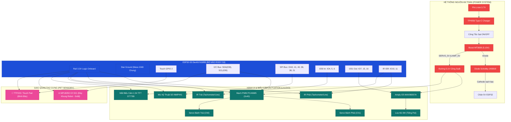

# Rody S3 Pet Edition (Gia Tốc Kế MPU6050 & Cảm Biến Chạm) – Sơ Đồ Đấu Dây Chuẩn Phần Cứng

> **Phiên bản:** `v0.3.0-pet`  
> **Kiến trúc:** ESP32-S3 DevKitC-1 N16R8 + Màn hình TFT 1.54" ST7789 + Mic I2S INMP441 + Amply Loa I2S MAX98357A + Driver PCA9685 + **Gia tốc kế 6 trục MPU6050** + **Cảm biến chạm điện dung TTP223** (hoặc Touch Pad đỉnh đầu).  
> **Interactive CAD Viewer:** Mở trực tiếp [wiring_pet_interactive.html](file:///Volumes/Builder/Arduino/OtooRobot/docs/hardware/wiring_pet_interactive.html) trong trình duyệt để soi từng đường dây, phóng to thu nhỏ và tra cứu từ khóa Shopee.

---

## 1. Bảng Linh Kiện Tổng Hợp (Bill of Materials - BOM)

| # | Linh kiện | Thông số kỹ thuật | Số lượng | Giá ước tính | Vai trò trong Rody S3 Pet Edition |
|:---:|:---|:---|:---:|:---:|:---|
| 1 | **ESP32-S3 DevKit N16R8** | 40-Pin, 16MB Flash, 8MB PSRAM (Octal), 2 cổng Type-C | 1 | ~135.000đ | Bộ não AI xử lý đa giác quan (Thị giác, Thính giác, Xúc giác, Thăng bằng) |
| 2 | **Cảm biến Gia Tốc & Con Quay MPU6050 (GY-521) / GY-6500 / GY-9250** | 6-DOF / 9-DOF IMU, $\pm 8g$, $\pm 1000^\circ/\text{s}$, I2C `0x68` hoặc `0x69` | 1 | ~18.000đ – 35.000đ | **[MỚI]** Cảm giác thăng bằng: phát hiện rơi tự do, ngửa bụng, lắc liên tục, gõ cơ học (GY-9250 tích hợp thêm La bàn số AK8963) |
| 3 | **Cảm biến Chạm Điện Dung TTP223** | Module mini 15x11mm, ngõ ra số HIGH khi chạm, hoặc lá nhôm | 1 | ~5.000đ | **[MỚI]** Xúc giác đỉnh đầu: cảm nhận vuốt ve, xoa đầu âu yếm |
| 4 | **Màn hình TFT 1.54" ST7789** | IPS 240x240 pixel, giao tiếp SPI (8 pin), góc nhìn 178° | 1 | ~58.000đ | Khuôn mặt cảm xúc sống động 60 FPS (mắt cún Mochi, chớp mắt, liếc, trái tim) |
| 5 | **Microphone I2S INMP441** | MEMS kỹ thuật số 24-bit, độ nhạy cao, ngõ ra I2S0 | 1 | ~38.000đ | Thính giác: thu âm giọng nói, đo cường độ tiếng ồn xung quanh |
| 6 | **Amply I2S MAX98357A** | DAC giải mã kỹ thuật số + Khuếch đại Class-D 3.2W (I2S1) | 1 | ~28.000đ | Giọng nói & tiếng kêu: phát âm thanh tiếng cún, tiếng rừ rừ purr, tiếng ngáy ngủ |
| 7 | **Loa Mini 4Ω 2W – 3W** | Kích thước Ø28mm – Ø40mm, dải âm ấm rõ | 1 | ~15.000đ | Tái tạo âm thanh phản hồi của robot |
| 8 | **Mạch PWM PCA9685** | 16 kênh PWM I2C (địa chỉ `0x40`), cọc vít cấp nguồn riêng | 1 | ~48.000đ | Điều khiển chính xác 2 servo bánh xe MG90S |
| 9 | **Động cơ Servo MG90S 360°** | Bánh răng kim loại, quay liên tục 360 độ | 2 | ~95.000đ (cặp) | Dẫn động 2 bánh xe: lắc mông vui sướng, xoay vòng tròn giãy giụa |
| 10| **Module Cảm biến IR (LM393)** | TCRT5000 / KY-032, ngõ ra số DO, biến trở chỉnh nhạy | 2 | ~24.000đ (cặp) | Đo tốc độ bánh xe (Tachometer) & Dò vạch sàn |
| 11| **Mạch sạc pin TP4056 Type-C** | Tích hợp chip bảo vệ pin DW01/8205A chống xả kiệt | 1 | ~8.000đ | Cổng sạc Type-C an toàn cho robot |
| 12| **Mạch tăng áp Boost MT3608** | Chỉnh áp ngõ ra đúng **5.10V**, dòng tải max 2A | 1 | ~12.000đ | Cấp nguồn riêng cho Động cơ Servo và Amply Loa |
| 13| **Diode Schottky 1N5819** | Dòng 1A, sụt áp cực thấp ~0.3V (hoặc SS14 / SS34) | 1 | ~1.500đ | Chống dòng USB chạy ngược vào mạch nguồn pin |
| 14| **Tụ hóa 470µF – 1000µF (≥10V)** | Gắn vào 2 cọc vít V+ / GND của PCA9685 | 1 | ~3.000đ | Ổn định dòng tức thời khi 2 servo đề-pa |
| 15| **Pin Li-ion 3.7V (18650 hoặc Lipo)** | Dung lượng 700mAh – 1200mAh, dòng xả ≥ 2A | 1 | ~45.000đ | Nguồn năng lượng di động cho robot |
| 16| **Công tắc gạt On/Off** | 2 chân hoặc 3 chân | 1 | ~3.000đ | Bật / Tắt an toàn hệ thống |
| 17| **Dây cắm Jumper Cái-Cái, Đực-Cái**| Dây 10cm - 20cm nhiều màu sắc | ~30 sợi | ~10.000đ | Kết nối nhanh các module |

**Tổng chi phí dự tính:** ~540.000đ (Robot thú cưng AI hoàn chỉnh với đầy đủ mắt, tai, miệng, xúc giác và thăng bằng).

---

## 2. Quy Ước Màu Dây Chuẩn (Color Coding)

Tuân thủ màu dây giúp việc kiểm tra và xử lý sự cố (troubleshooting) diễn ra chỉ trong vài giây:

| Màu Dây | Ký Hiệu | Ý Nghĩa Kỹ Thuật | Điểm Nối Điển Hình |
|:---:|:---:|:---|:---|
| 🔴 **ĐỎ** | `SERVO_5V` | Nguồn công suất 5.10V từ Boost MT3608 | Ngõ OUT+ Boost ➔ Cọc V+ PCA9685 & Vin MAX98357A |
| 🟠 **CAM** | `LOGIC_5V` | Nguồn 5V logic vào ESP32 sau Diode | Chân Cathode Diode 1N5819 ➔ Chân 5V ESP32 |
| ⚪ **TRẮNG** | `3V3_BUS` | Nguồn 3.3V chuẩn từ LDO onboard ESP32 | Chân 3V3 ESP32 ➔ VCC của MPU6050, TTP223, TFT, Mic, IR |
| ⚫ **ĐEN** | `GND` | Mass chung toàn hệ thống (**Star Ground**) | Nối toàn bộ chân GND của tất cả linh kiện lại với nhau |
| 🟡 **VÀNG** | `I2C_SDA` | Bus dữ liệu I2C chung (GPIO 8) | GPIO 8 ➔ SDA của PCA9685 & SDA của MPU6050 |
| 🟣 **TÍM** | `I2C_SCL` | Bus xung nhịp I2C chung (GPIO 9) | GPIO 9 ➔ SCL của PCA9685 & SCL của MPU6050 |
| 🌸 **HỒNG** | `TOUCH_SIG` | Tín hiệu chạm đỉnh đầu (GPIO 2) | GPIO 2 ➔ Chân I/O (SIG) của TTP223 |
| 🔵 **XANH DƯƠNG** | `SPI_TFT` | Các đường SPI điều khiển màn hình TFT | GPIO 42, 41, 40, 39, 38, 21 |
| 🟢 **XANH LÁ** | `I2S_AUDIO` | Tín hiệu âm thanh số Mic & Loa | GPIO 4, 5, 6 (Mic) và GPIO 7, 15, 16 (Amply) |

---

## 3. Cây Phân Phối Nguồn (Power Distribution Architecture)

```
  Pin Li-ion 3.7V (1S) 
         │
         ▼
  TP4056 Type-C Charger (B+/B-) ──OUT+──► [CÔNG TẮC GẠT ON/OFF] ──► (VBAT_SW)
         │                                                            │
     Cổng sạc                                                         ▼
     Type-C                                                  Mạch Boost MT3608 (IN+)
                                                                      │
                                                Boost OUT+ (Vặn đo đúng 5.10V)
                                                     │                │
            ┌────────────────────────────────────────┘                └─────────────────┐
            ▼                                                                           ▼
   Cọc V+ PCA9685 (ĐỘNG CƠ)                                                    Chân Anode Diode 1N5819
   (Kèm tụ hóa 1000uF chống sụt áp)                                                     │
            │                                                                           ▼ (Vạch bạc Cathode)
            ├─► Nuôi Servo Bánh Trái (Ch0)                                       Chân 5V của ESP32-S3
            ├─► Nuôi Servo Bánh Phải (Ch1)                                              │
            └─► Nuôi Chân Vin MAX98357A (Loa to, rõ tiếng)                     LDO 3.3V Onboard ESP32
                                                                                        │
            ┌──────────────────────┬──────────────────────┬─────────────────────────────┴───────────────────────┐
            ▼                      ▼                      ▼                             ▼                       ▼
    MPU6050 GY-521        TTP223 Touch Pad        TFT ST7789 1.54"              INMP441 I2S Mic         PCA9685 & 2x IR
       (VCC 3.3V)             (VCC 3.3V)             (VCC 3.3V)                    (VDD 3.3V)              (VCC 3.3V)
      (~3.8mA 3.3V)          (~1.5µA 3.3V)          (~50mA 3.3V)                   (~2mA 3.3V)             (~30mA 3.3V)

  ═══════════════════════════════════════════════════════════════════════════════════════════════════════════════════════
  [QUY TẮC BẮT BUỘC]: TẤT CẢ CHÂN GND (Pin, TP4056, Boost, ESP32, MPU6050, Touch, TFT, Mic, Amp, IR) NỐI CHUNG 1 MASS!
  ═══════════════════════════════════════════════════════════════════════════════════════════════════════════════════════
```

---

## 4. Sơ Đồ Chân Thực Tế ESP32-S3 DevKit 40-Pin

Mặt trước bo mạch (Anten Wi-Fi phía trên, 2 cổng USB-C phía dưới):

```
                        +-------------------+
                        |   [ ANTENNA ]     |
                        |   ESP32-S3 N16R8  |
                        +-------------------+
 (Nguồn 3.3V Bus) [ 1] 3V3| *               * |GND [21] (Mass GND Bus Phải)
 (EN / Reset)     [ 2]  EN| *               * |TX  [22] (GPIO43 - UART0 Debug)
 (INMP441 SCK)    [ 3] IO4| *               * |RX  [23] (GPIO44 - UART0 Debug)
 (INMP441 WS)     [ 4] IO5| *               * |IO1 [24] (ADC1 Pin - Dự phòng)
 (INMP441 SD In)  [ 5] IO6| *               * |IO2 [25] 🐾 TTP223 TOUCH SENSOR (SIG)
 (MAX98357A DIN)  [ 6] IO7| *               * |IO42[26] (TFT SCL / SPI SCK)
 (MAX98357A LRC)  [ 7]IO15| *               * |IO41[27] (TFT SDA / SPI MOSI)
 (MAX98357A BCLK) [ 8]IO16| *               * |IO40[28] (TFT DC - Data/Command)
                  [ 9]IO17| *               * |IO39[29] (TFT RES - Reset)
                  [10]IO18| *               * |IO38[30] (TFT CS - Chip Select)
 (I2C SDA Chung)  [11] IO8| *               * |IO37[31] (⛔ CẤM: PSRAM Octal)
 (⛔ Strapping)   [12] IO3| *               * |IO36[32] (⛔ CẤM: PSRAM Octal)
 (⛔ Strapping)   [13]IO46| *               * |IO35[33] (⛔ CẤM: PSRAM Octal)
 (I2C SCL Chung)  [14] IO9| *               * |IO0 [34] (Nút BOOT)
 (IR_L Dò Trái)   [15]IO10| *               * |IO45[35] (⛔ CẤM: Strapping Flash)
 (IR_R Dò Phải)   [16]IO11| *               * |IO48[36] (RGB WS2812 Onboard)
                  [17]IO12| *               * |IO47[37] (SPICLK)
                  [18]IO13| *               * |IO21[38] (TFT BLK - Đèn Nền PWM)
 (Nguồn 5V vào)   [19]  5V| *               * |IO20[39] (⛔ USB OTG D+)
 (Mass GND Bus)   [20] GND| *               * |IO19[40] (⛔ USB OTG D-)
                        |   [BOOT]   [RST]  |
                        |   [USB]    [UART] |
                        +-------------------+
```

---

## 5. Hướng Dẫn Nối Dây Chi Tiết Theo Phân Hệ

### Phân Hệ 1: Cảm Biến Gia Tốc & Quán Tính IMU MPU6050 (GY-521) / GY-6500 / GY-9250
*Được gắn phẳng ở đáy robot, giữa 2 bánh xe. Chia sẻ chung đường I2C (SDA=IO8, SCL=IO9) với PCA9685.*

| Chân Module | Nối Tới ESP32-S3 / Nguồn | Loại Tín Hiệu | Màu Dây | Ghi Chú Kỹ Thuật Cho GY-521 / GY-6500 / GY-9250 |
|:---:|:---:|:---:|:---:|:---|
| **VCC** | **Chân 1 (3V3)** | Nguồn 3.3V | Trắng | **BẮT BUỘC dùng 3.3V**: Cấp từ LDO sạch của ESP32. Tuyệt đối không nối 5V để tránh rò áp 5V vào chân I2C của ESP32. |
| **GND** | **Chân 20 (GND)**| Mass | Đen | Nối mass chung toàn mạch |
| **SCL** | **Chân 14 (IO9)**| I2C Clock | Tím | Chung đường I2C SCL với PCA9685 |
| **SDA** | **Chân 11 (IO8)**| I2C Data | Vàng | Chung đường I2C SDA với PCA9685 |
| **AD0** | **Chân GND (hoặc để hở)** | Cấu hình địa chỉ | Đen ngắn | Nối GND để có địa chỉ `0x68`. Nếu để hở/kéo cao địa chỉ sẽ là `0x69`. **Firmware tự động quét (Auto-probe) cả 2 địa chỉ!** |
| **INT** | Để hở | Ngắt | - | Firmware đọc dữ liệu polling 50Hz qua FreeRTOS |
| **EDA / ECL** | Để hở | I2C Aux | - | Bus phụ của IMU, không nối vào ESP32 |

> [!TIP]
> **Điểm khác biệt quan trọng giữa MPU6050, GY-6500 và GY-9250:**
> 1. **Mã nhận diện chip (`WHO_AM_I` thanh ghi 0x75):**
>    - **MPU6050 (GY-521):** Trả về `0x68`.
>    - **MPU6500 (GY-6500):** Trả về `0x70`.
>    - **MPU9250 (GY-9250):** Trả về `0x71` (với bản MPU9255 là `0x73`).
>    - 👉 Firmware Rody S3 tự động nhận diện cả 3 dòng chip, tự gán bộ lọc gia tốc DLPF phù hợp.
> 2. **La bàn số 3 trục AK8963 (Chỉ có trên GY-9250):**
>    - Chip MPU-9250 tích hợp sẵn cảm biến từ trường AK8963 (Magnetometer).
>    - Firmware Rody tự động kích hoạt **I2C Bypass Mode** (`INT_PIN_CFG = 0x02`), mở đường cho AK8963 lộ diện trực tiếp tại địa chỉ I2C **`0x0C`**. Công cụ chẩn đoán I2C Scanner và Self-test của robot sẽ báo nhận diện thành công 9-DOF.
> 3. **Quy ước trục cảm biến:**
>    - Trục **$X$** hướng về phía trước mui xe.
>    - Trục **$Y$** hướng sang sườn phải.
>    - Trục **$Z$** hướng thẳng đứng lên trời ($\approx +1.0g$ khi robot đứng yên).
>    - Khi bị lật ngửa bụng: $a_z < -0.5g$ ➔ Kích hoạt ngay trạng thái giãy giụa và kêu cứu!
>    - Khi rơi tự do: $|a| = \sqrt{a_x^2 + a_y^2 + a_z^2} < 0.25g$ ➔ Mắt nhắm tịt hoảng loạn!

---

### Phân Hệ 2: Cảm Biến Chạm Điện Dung TTP223 (Xúc Giác Đỉnh Đầu)
*Dán ở mặt trong nắp vỏ đầu robot hoặc trán robot.*

| Chân TTP223 | Nối Tới ESP32-S3 | Loại Tín Hiệu | Màu Dây | Ghi Chú Kỹ Thuật |
|:---:|:---:|:---:|:---:|:---|
| **VCC** | **Chân 1 (3V3)** | Nguồn 3.3V | Trắng | Ăn dòng cực thấp (~1.5µA) |
| **GND** | **Chân 21 (GND)**| Mass | Đen | Mass chung |
| **I/O (SIG)** | **Chân 25 (IO2)**| Tín hiệu số | Hồng | Xuất mức HIGH khi có ngón tay chạm/vuốt |

> [!NOTE]
> **Tùy chọn không cần mua module TTP223:** Bạn có thể chỉ cần hàn 1 sợi dây điện từ **GPIO 2** ra một miếng **băng dính nhôm / lá đồng mỏng** (kích thước ~20x20mm) dán bên trong vỏ 3D. ESP32-S3 có sẵn bộ cảm ứng điện dung phần cứng (`touchRead(2)`), firmware sẽ tự động đọc thay đổi điện dung khi bạn vuốt ve!

---

### Phân Hệ 3: Màn Hình Biểu Cảm TFT 1.54" ST7789 SPI
*Giao tiếp SPI DMA phần cứng tốc độ cao.*

| Chân Màn Hình | Nối Tới Chân ESP32 | Loại Tín Hiệu | Màu Dây | Ghi Chú Kỹ Thuật |
|:---:|:---:|:---:|:---:|:---|
| **VCC** | **Chân 1 (3V3)** | Nguồn 3.3V | Trắng | Cấp từ rail 3.3V |
| **GND** | **Chân 21 (GND)**| Mass | Đen | Mass chung |
| **SCL** | **Chân 26 (IO42)**| SPI Clock | Xanh dương | Xung SPI (40MHz – 80MHz) |
| **SDA** | **Chân 27 (IO41)**| SPI MOSI | Xanh ngọc | Dữ liệu đồ họa từ ESP32 |
| **DC**  | **Chân 28 (IO40)**| Data/Command | Vàng cam | Chọn thanh ghi lệnh / điểm ảnh |
| **RES** | **Chân 29 (IO39)**| Hardware Reset | Cam | Reset cứng màn hình |
| **CS**  | **Chân 30 (IO38)**| Chip Select | Tím | Mức LOW kích hoạt giao tiếp |
| **BLK** | **Chân 38 (IO21)**| Backlight PWM | Nâu nhạt | Điều chỉnh độ sáng mắt qua PWM |

---

### Phân Hệ 4: Microphone I2S Kỹ Thuật Số INMP441
*Thu nhận giọng nói và đo cường độ ồn môi trường.*

| Chân INMP441 | Nối Tới Chân ESP32 | Loại Tín Hiệu | Màu Dây | Ghi Chú Kỹ Thuật |
|:---:|:---:|:---:|:---:|:---|
| **VDD** | **Chân 1 (3V3)** | Nguồn 3.3V | Trắng | **CẤM cấp 5V** (cháy màng rung MEMS) |
| **GND** | **Chân 20 (GND)**| Mass | Đen | Mass chung |
| **SCK** | **Chân 3 (IO4)** | I2S0 BCLK | Vàng | Xung đồng hồ âm thanh |
| **WS**  | **Chân 4 (IO5)** | I2S0 Word Select| Xanh lá | Chọn khung từ âm thanh |
| **SD**  | **Chân 5 (IO6)** | I2S0 Serial Data| Xanh dương | Dữ liệu PCM 24-bit gửi về ESP32 |
| **L/R** | **Nối Mass GND** | Chọn Kênh | Đen ngắn | Nối GND để chọn thu Kênh Trái (Left) |

---

### Phân Hệ 5: Mạch Giải Mã & Loa I2S MAX98357A
*Phát âm thanh tiếng kêu và hiệu ứng pet sống động.*

| Chân MAX98357A | Nối Tới Vị Trí | Loại Tín Hiệu | Màu Dây | Ghi Chú Kỹ Thuật |
|:---:|:---:|:---:|:---:|:---|
| **VIN** | **Đường 5V Boost (5.10V)** | Nguồn 5V | Đỏ | Cấp 5V để âm lượng loa to ấm, không vỡ tiếng |
| **GND** | **GND Chung** | Mass | Đen | Mass chung |
| **DIN** | **Chân 6 (IO7)** | I2S1 Data Out | Cam đậm | Dữ liệu âm thanh phát từ ESP32 |
| **LRC** | **Chân 7 (IO15)** | I2S1 Word Select| Tím nhạt | Xung chọn kênh phát |
| **BCLK**| **Chân 8 (IO16)** | I2S1 Bit Clock | Xanh dương | Xung nhịp bit I2S1 |
| **GAIN**| Để hở (Floating) | Độ lợi | - | Mặc định 9dB chuẩn, không bị rè |
| **SD**  | Để hở (Floating) | Kênh phát | - | Mặc định giải mã mono hỗn hợp (L+R)/2 |
| **SPK+**| Cực (+) Loa 4Ω | Ra Loa | Đỏ | Nối vào 1 dây của loa |
| **SPK-**| Cực (-) Loa 4Ω | Ra Loa | Đen | **CẤM NỐI VÀO GND!** (Cầu vi sai BTL) |

---

### Phân Hệ 6: Mạch PWM PCA9685 & 2 Servo Bánh Xe MG90S 360°
*Dẫn động chuyển động và biểu cảm hành vi cơ học.*

1. **Hàng 6 chân tín hiệu bên hông PCA9685:**
   - `VCC` ➔ Chân 1 (`3V3`) ESP32 (chỉ nuôi chip logic PCA9685).
   - `GND` ➔ Chân 20 (`GND`) ESP32.
   - `SDA` ➔ Chân 11 (`IO8`) ESP32 (chung bus I2C với MPU6050).
   - `SCL` ➔ Chân 14 (`IO9`) ESP32 (chung bus I2C với MPU6050).
   - `OE`  ➔ Để hở (tự kéo LOW bằng phần cứng).
   - `V+`  ➔ Để hở (nguồn động cơ cấp qua cọc vít xanh).

2. **Cọc vít cấp nguồn động cơ (Terminal xanh dương):**
   - Cọc `V+`: Dây ĐỎ nối từ Boost `OUT+` (5.10V).
   - Cọc `GND`: Dây ĐEN nối về Mass GND chung.
   - **Tụ hóa 470µF – 1000µF (≥10V):** Cực (+) cắm vào cọc `V+`, cực (-) sọc trắng cắm vào cọc `GND`.

3. **Giắc cắm 3 chân của 2 Servo MG90S 360°:**
   - **Bánh Trái cắm Kênh 0 (Ch0):** Dây Cam (PWM) trên cùng, Dây Đỏ (V+) ở giữa, Dây Nâu (GND) ở dưới.
   - **Bánh Phải cắm Kênh 1 (Ch1):** Tương tự theo đúng thứ tự Cam - Đỏ - Nâu.

---

### Phân Hệ 7: Cụm Cảm Biến Hồng Ngoại IR (Tachometer & Dò Line)
*Được gắn ở 2 bên bánh xe soi vào đĩa sọc (hoặc hướng xuống sàn).*

| Cảm biến | Chân Module IR | Nối Tới ESP32-S3 | Loại Tín Hiệu | Màu Dây | Ghi Chú |
|:---:|:---:|:---:|:---:|:---:|:---|
| **IR Trái** | **VCC** | **Chân 1 (3V3)** | Nguồn logic | Trắng | Cấp 3.3V |
| | **GND** | **Chân 20 (GND)**| Mass | Đen | Mass chung |
| | **DO**  | **Chân 15 (IO10)**| Ngắt số (ISR) | Xanh lá | Đếm xung bánh trái / Dò sàn |
| **IR Phải**| **VCC** | **Chân 1 (3V3)** | Nguồn logic | Trắng | Cấp 3.3V |
| | **GND** | **Chân 20 (GND)**| Mass | Đen | Mass chung |
| | **DO**  | **Chân 16 (IO11)**| Ngắt số (ISR) | Xanh lơ | Đếm xung bánh phải / Dò sàn |

---

### Phân Hệ 8: Cụm Nguồn Pin Li-ion, Sạc TP4056 & Boost 5V
1. Cực dương (+) Pin nối vào chân `B+` của mạch sạc TP4056.
2. Cực âm (-) Pin nối vào chân `B-` của mạch sạc TP4056.
3. Chân `OUT+` của TP4056 nối vào 1 chân của **Công tắc gạt**.
4. Chân ra của Công tắc gạt (`VBAT_SW`) nối vào ngõ `IN+` của **Mạch Boost MT3608**.
5. Chân `OUT-` của TP4056 nối vào `IN-` Boost và nối vào Mass GND chung.
6. **Vặn ốc biến trở trên MT3608** (dùng đồng hồ VOM đo) cho đến khi ngõ ra đạt đúng **5.10V – 5.15V**.
7. Ngõ `OUT+` của Boost chia 2 nhánh:
   - **Nhánh 1:** Dây ĐỎ nối vào cọc vít `V+` của PCA9685 và chân `VIN` của MAX98357A.
   - **Nhánh 2:** Dây ĐỎ nối vào chân **Anode** (phía thân đen trơn) của Diode 1N5819.
8. Chân **Cathode** (phía có vạch trắng bạc) của Diode 1N5819 nối bằng dây CAM vào chân `5V` (Chân 19) của ESP32-S3.

---

## 6. Sơ Đồ Khối Tổng Thể (Mermaid Architecture)



---

## 7. Các Chân Tuyệt Đối CẤM Nối Dây (ESP32-S3 Hardware Safety)

Để bảo vệ chip ESP32-S3 không bị hỏng hóc hoặc treo vĩnh viễn:

| Chân ESP32-S3 | Chức Năng Bị Xung Đột | Hậu Quả Khôn Lường Nếu Nối Dây |
|:---:|:---|:---|
| **GPIO 26 – 37** | Đường truyền Octal SPI tốc độ cao nối Flash 16MB & PSRAM 8MB | Robot lập tức bị lỗi văng Bootloader Crash (`Core Panicked`) |
| **GPIO 45** | Chân cài đặt Strapping điện áp VDD_SPI | Nếu bị kéo HIGH khi boot, Flash chuyển sang 1.8V gây **CHÁY BOOTLOADER** vĩnh viễn |
| **GPIO 19, 20** | Đường tín hiệu vi sai Native USB OTG (D- và D+) | Mất khả năng nạp code và giao tiếp máy tính |
| **GPIO 43, 44** | Cổng UART0 Log Debug | Không nối ngoại vi ngoài tránh xung đột cổng nạp Serial |
| **GPIO 0, 3, 46** | Các chân Strapping chọn chế độ khởi động | Không nối linh kiện có điện trở kéo ngoài kéo sai mức logic khi boot |

---

## 8. Bảng Đo Kiểm An Toàn Trước Khi Bật Nguồn (Gate G0 Checklist)

Trước khi bật công tắc lần đầu tiên, hãy dùng đồng hồ VOM đo tuần tự 8 điểm kiểm tra sau:

| Mã | Thao Tác Đo Kiểm | Tiêu Chuẩn Đạt | Xử Lý Khi Thất Bại |
|:---:|:---|:---:|:---|
| **M1** | Đo điện trở giữa `5V Boost` và `GND` (công tắc TẮT) | **> 1.000 Ω (Không chập)** | Có chập nguồn 5V, kiểm tra lại cọc vít PCA9685 và chân Amply |
| **M2** | Đo điện trở giữa `3V3 ESP32` và `GND` | **> 500 Ω (Không chập)** | Có chập nguồn 3.3V, kiểm tra VCC của MPU6050, Touch và TFT |
| **M3** | Đo điện áp 2 cực Pin (`B+` và `B-` trên TP4056) | **3.6V – 4.2V** | Pin cạn (<3.0V), hãy cắm sạc Type-C cho TP4056 trước |
| **M4** | Bật công tắc, đo áp tại ngõ `OUT+` của mạch Boost | **5.05V – 5.15V** | Vặn biến trở ngược chiều kim đồng hồ để tăng áp đạt chuẩn |
| **M5** | Đo áp tại chân `5V` của ESP32 (sau Diode 1N5819) | **4.75V – 4.95V** | Diode bị cắm ngược chiều, đảo lại vạch trắng bạc về phía chân 5V ESP32 |
| **M6** | Đo áp tại chân `3V3` của ESP32 | **3.25V – 3.35V** | LDO onboard của ESP32 hoạt động hoàn hảo |
| **M7** | Đo cực tính ngõ ra Loa trên MAX98357A | **Không chạm GND** | Cực SPK- tuyệt đối không được tiếp xúc với vỏ robot hay mass chung |
| **M8** | Đo thông mạch SDA/SCL giữa ESP32, PCA9685 và IMU (MPU6050/6500/9250) | **0 Ω (Thông mạch)** | Bus I2C đã liên kết hoàn chỉnh PCA9685 (0x40) và IMU (0x68 hoặc 0x69) |

---

## 9. Khắc Phục Sự Cố Nhanh (Troubleshooting)

1. **Khởi động robot báo lỗi `IMU not detected` trên Serial Monitor:**
   - Kiểm tra thông mạch dây SDA (GPIO 8) và SCL (GPIO 9) xem có bị lỏng hoặc cắm chéo nhau không.
   - Kiểm tra chân VCC cảm biến: Đã nối đúng nguồn **3.3V** chưa (đèn LED đỏ trên module GY-521/6500/9250 phải sáng).
   - Kiểm tra chân AD0: Nếu nối GND, địa chỉ là `0x68`; nếu nối 3.3V hoặc thả nổi (trên một số bo GY-6500/GY-9250 có trở kéo lên), địa chỉ là `0x69`. Firmware mới tự động nhận diện cả 2 địa chỉ, nhưng nếu lỏng chân tín hiệu SDA/SCL thì chip sẽ không phản hồi.
   - Nếu dùng GY-9250, vào Web Diagnostic Center bấm **Quét Ngay** I2C: Bạn sẽ thấy xuất hiện cả `0x68` (hoặc `0x69`) kèm la bàn số `0x0C` (AK8963).
2. **Vuốt ve đầu nhưng robot không có phản ứng:**
   - Kiểm tra dây tín hiệu từ TTP223 có cắm đúng chân `GPIO 2` không.
   - Nếu dùng cảm ứng điện dung trực tiếp bằng lá nhôm, hãy mở Serial Monitor xem giá trị `touchRead(2)` khi chạm và khi không chạm để căn chỉnh ngưỡng nhạy trong file `src/touch_sensor.cpp`.
3. **Loa bị xì rè hoặc sụt nguồn khi động cơ quay:**
   - Đảm bảo đã gắn tụ hóa 1000µF vào cọc vít PCA9685.
   - Kiểm tra mạch Boost MT3608 có bị tụt áp dưới 4.8V khi 2 servo cùng quay không. Nếu có, tăng nhẹ điện áp Boost lên 5.15V.
