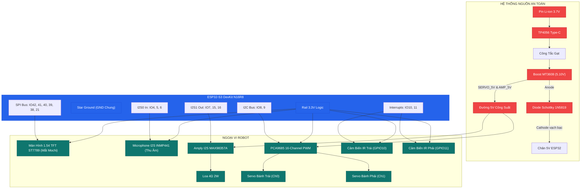

# Rody S3 AI (Xiaozhi / Mochi Pet) – Sơ Đồ Đấu Dây Chuẩn (Hardware Wiring Standard)

> **Mô hình triển khai:** Nâng cấp Rody S3 thành robot AI tương tác giọng nói tiếng Việt với Màn hình biểu cảm TFT 1.54" ST7789, Thu âm Mic I2S INMP441, Phát âm thanh Loa I2S MAX98357A, và Hệ thống lái 2 Servo qua PCA9685.

---

## 1. Bảng Linh Kiện (Bill of Materials - BOM)

| # | Linh kiện | Thông số kỹ thuật | Số lượng | Vai trò trong robot |
|:---:|:---|:---|:---:|:---|
| 1 | **ESP32-S3 DevKit N16R8** | 40-Pin, 16MB Flash, 8MB PSRAM (Octal), 2 cổng USB-C | 1 | Bo mạch điều khiển & xử lý AI trung tâm |
| 2 | **Màn hình TFT 1.54" ST7789** | IPS 240x240, giao tiếp SPI (7 hoặc 8 pin) | 1 | Hiển thị biểu cảm đôi mắt Mochi/Xiaozhi sống động |
| 3 | **Microphone I2S INMP441** | MEMS kỹ thuật số 24-bit, độ nhạy cao, ngõ ra I2S | 1 | Thu âm giọng nói, nhận diện từ khóa (Wake-word) |
| 4 | **Amply I2S MAX98357A** | DAC giải mã kỹ thuật số + Khuếch đại Class-D 3.2W | 1 | Phát âm thanh phản hồi, giọng nói AI, hiệu ứng SFX |
| 5 | **Loa Mini 4Ω 2W – 3W** | Kích thước 28mm – 40mm, dải âm ấm rõ | 1 | Tái tạo âm thanh robot phát ra |
| 6 | **Mạch PWM PCA9685** | 16 kênh PWM I2C, cọc vít cấp nguồn động cơ riêng | 1 | Điều khiển chính xác tốc độ 2 Servo MG90S |
| 7 | **Động cơ Servo MG90S 360°** | Bánh răng kim loại, quay liên tục 360 độ | 2 | Dẫn động bánh xe Trái (Ch0) và Phải (Ch1) |
| 8 | **Module Cảm biến IR (LM393)** | TCRT5000 / KY-032, ngõ ra số DO, có biến trở chỉnh | 2 | Đếm xung tốc độ bánh xe (Tachometer) & Dò line |
| 9 | **Mạch sạc pin TP4056** | Cổng Type-C, tích hợp chip bảo vệ pin (DW01/8205A) | 1 | Sạc pin an toàn và chống xả kiệt pin |
| 10| **Mạch tăng áp Boost 5V (MT3608)**| Chỉnh áp ngõ ra đúng 5.10V, dòng tải ≥ 2A | 1 | Cấp nguồn công suất riêng cho Servo & Amply Loa |
| 11| **Diode Schottky 1N5819** | Dòng 1A, sụt áp thấp ~0.3V (hoặc SS14 / SS34) | 1 | Chống dòng USB chạy ngược vào pin khi cắm máy tính |
| 12| **Tụ hóa 470µF – 1000µF (≥10V)** | Tụ lọc nguồn gắn cọc vít PCA9685 | 1 | Chống sụt áp khi 2 servo khởi động cùng lúc |
| 13| **Công tắc gạt 2 hoặc 3 chân** | Bật / Tắt toàn bộ nguồn hệ thống | 1 | Đảm bảo an toàn khi nạp code hoặc nghỉ |
| 14| **Pin Li-ion 3.7V** | 18650 hoặc Pin Lipo 700mAh – 1200mAh (xả tốt) | 1 | Nguồn năng lượng di động cho robot |
| 15| **Dây cắm breadboard / jumper** | Dây Đực-Cái, Đực-Đực nhiều màu | ~25 sợi | Kết nối các module |

---

## 2. Quy Ước Màu Dây Tiêu Chuẩn

Để tránh nhầm lẫn và đo kiểm nhanh chóng, hãy tuân thủ quy ước màu dây sau:
- **ĐỎ (`RED`)**: Nguồn 5V công suất (`SERVO_5V` / `AMP_5V` sau mạch Boost).
- **CAM (`ORANGE`)**: Nguồn 5V logic (`LOGIC_5V` sau diode 1N5819 vào chân 5V ESP32).
- **TRẮNG (`WHITE`)**: Nguồn logic 3.3V từ chân `3V3` của ESP32 (cấp cho TFT, Mic, PCA9685 chip, IR).
- **ĐEN (`BLACK`)**: Đường mass chung toàn hệ thống (**Common Star GND**).
- **VÀNG (`YELLOW`)**: Tín hiệu bus I2C (`SDA` = GPIO 8, `SCL` = GPIO 9).
- **TÍM / XANH LỤC (`PURPLE / GREEN`)**: Tín hiệu I2S Mic & Amply Loa.
- **XANH DƯƠNG (`CYAN / BLUE`)**: Tín hiệu màn hình SPI (`SCLK`, `MOSI`, `DC`, `RES`, `CS`, `BLK`).

---

## 3. Cây Phân Phối Nguồn (Power Distribution Tree)

```
 Pin Li-ion 3.7V ──► TP4056 (B+/B-) ──OUT+──► [CÔNG TẮC GẠT] ──► (VBAT_SW)
                          │                                           │
                      Cổng sạc                                        ▼
                      Type-C                                 Mạch Boost MT3608 (IN+)
                                                                      │
                                                Boost OUT+ (Chỉnh chuẩn 5.10V)
                                                     │                │
            ┌────────────────────────────────────────┘                └─────────────────┐
            ▼                                                                           ▼
   Cọc V+ của PCA9685 (ĐỘNG CƠ)                                                Chân Anode Diode 1N5819
   (Kèm tụ hóa 1000uF chống sụt áp)                                                     │
            │                                                                           ▼ (Vạch bạc Cathode)
            ├─► Nuôi Servo Bánh Trái (Ch0)                                       Chân 5V của ESP32-S3
            ├─► Nuôi Servo Bánh Phải (Ch1)                                              │
            └─► Nuôi Chân Vin Amply MAX98357A (Loa to, sạch)                   Bộ ổn áp LDO 3.3V trên ESP32
                                                                                        │
            ┌───────────────────────────────────────────────────────────────────────────┴────────────────────────┐
            ▼                                           ▼                                                        ▼
    ST7789 TFT 1.54" (VCC)                   INMP441 I2S Mic (VDD)                                     PCA9685 & 2x IR (VCC)
       (Ăn ~50mA 3.3V)                           (Ăn ~2mA 3.3V)                                           (Ăn ~30mA 3.3V)

  ═════════════════════════════════════════════════════════════════════════════════════════════════════════════════════
  [QUY TẮC SỐNG CÒN]: TẤT CẢ CHÂN GND (Pin, TP4056, Boost, ESP32, PCA9685, TFT, Mic, Amply, IR) PHẢI NỐI CHUNG VỚI NHAU!
  ═════════════════════════════════════════════════════════════════════════════════════════════════════════════════════
```

> [!TIP]
> **Ưu điểm của mạch nguồn này:**
> 1. Nhờ có **Diode Schottky 1N5819**, bạn hoàn toàn có thể cắm cáp USB máy tính vào ESP32 để nạp code và debug **KHI CÔNG TẮC NGUỒN PIN ĐANG BẬT** mà không sợ dòng USB chạy ngược làm nổ mạch tăng áp hay chai pin!
> 2. Động cơ servo và loa ăn nguồn riêng 5.1V từ mạch Boost, triệt tiêu 100% hiện tượng sụt áp làm ESP32 bị khởi động lại (Brownout Reset).

---

## 4. Sơ Đồ Chân Thực Tế ESP32-S3 DevKit 40-Pin

Nhìn trực diện mặt trước bo mạch (cụm anten Wi-Fi ở phía trên, 2 cổng USB-C ở phía dưới):

```
                        +-------------------+
                        |   [ ANTENNA ]     |
                        |   ESP32-S3 N16R8  |
                        +-------------------+
 (Nguồn 3.3V Bus) [ 1] 3V3| *               * |GND [21] (Mass GND Bus)
 (EN / Reset)     [ 2]  EN| *               * |TX  [22] (GPIO43 - UART0 Debug)
 (INMP441 SCK)    [ 3] IO4| *               * |RX  [23] (GPIO44 - UART0 Debug)
 (INMP441 WS)     [ 4] IO5| *               * |IO1 [24] (ADC1 - Dự phòng)
 (INMP441 SD)     [ 5] IO6| *               * |IO2 [25] (Nút chạm Touch)
 (MAX98357A DIN)  [ 6] IO7| *               * |IO42[26] (TFT SCL / SPI SCK)
 (MAX98357A LRC)  [ 7]IO15| *               * |IO41[27] (TFT SDA / SPI MOSI)
 (MAX98357A BCLK) [ 8]IO16| *               * |IO40[28] (TFT DC)
                  [ 9]IO17| *               * |IO39[29] (TFT RES / Reset)
                  [10]IO18| *               * |IO38[30] (TFT CS - Chip Select)
 (PCA9685 SDA)    [11] IO8| *               * |IO37[31] (⛔ CẤM: PSRAM Octal)
 (⛔ Strapping)   [12] IO3| *               * |IO36[32] (⛔ CẤM: PSRAM Octal)
 (⛔ Strapping)   [13]IO46| *               * |IO35[33] (⛔ CẤM: PSRAM Octal)
 (PCA9685 SCL)    [14] IO9| *               * |IO0 [34] (Nút BOOT)
 (IR_L Dò Trái)   [15]IO10| *               * |IO45[35] (⛔ CẤM: Strapping Flash)
 (IR_R Dò Phải)   [16]IO11| *               * |IO48[36] (RGB LED onboard)
                  [17]IO12| *               * |IO47[37] (SPICLK)
                  [18]IO13| *               * |IO21[38] (TFT BLK - Backlight PWM)
 (Nguồn 5V vào)   [19]  5V| *               * |IO20[39] (⛔ USB OTG D+)
 (Mass GND Bus)   [20] GND| *               * |IO19[40] (⛔ USB OTG D-)
                        |   [BOOT]   [RST]  |
                        |   [USB]    [UART] |
                        +-------------------+
```

---

## 5. Hướng Dẫn Nối Dây Chi Tiết Từng Module (6 Bước Thực Hiện)

### Bước 1: Nối Màn Hình TFT 1.54" ST7789 (Hàng Chân Phải ESP32)
*Màn hình hiển thị hoạt ảnh mắt biểu cảm robot tốc độ 60 FPS qua bus SPI phần cứng.*

| Chân Màn Hình TFT | Nối Tới Chân ESP32-S3 | Loại Tín Hiệu | Màu Dây Khuyên Dùng | Ghi Chú Kỹ Thuật |
|:---:|:---:|:---:|:---:|:---|
| **VCC** | **Chân 1 (3V3)** | Nguồn 3.3V | Trắng | Ăn dòng ~50mA, cấp từ rail 3V3 của ESP32 |
| **GND** | **Chân 21 (GND)**| Mass | Đen | Nối vào mass chung |
| **SCL / SCLK** | **Chân 26 (IO42)**| SPI Clock | Xanh dương | Xung nhịp SPI (chạy 40MHz - 80MHz) |
| **SDA / MOSI** | **Chân 27 (IO41)**| SPI Data | Xanh lục nhạt| Dữ liệu hình ảnh từ ESP32 sang màn hình |
| **DC** | **Chân 28 (IO40)**| Lệnh / Data | Vàng | Chọn chế độ truyền Command hoặc Data |
| **RES / RST** | **Chân 29 (IO39)**| Reset cứng | Cam | Reset phần cứng màn hình khi khởi động |
| **CS** | **Chân 30 (IO38)**| Chip Select | Tím | Kích hoạt màn hình (mức LOW) |
| **BLK / BL** | **Chân 38 (IO21)**| Đèn nền LED | Nâu / Đỏ nhạt| Điều khiển độ sáng PWM qua LEDC (hoặc nối 3V3) |

---

### Bước 2: Nối Micro I2S Kỹ Thuật Số INMP441 (Hàng Chân Trái ESP32)
*Microphone MEMS thu âm giọng nói lọc ồn độ nhạy cao để nhận lệnh.*

| Chân INMP441 | Nối Tới Chân ESP32-S3 | Loại Tín Hiệu | Màu Dây | Ghi Chú Kỹ Thuật |
|:---:|:---:|:---:|:---:|:---|
| **VDD** | **Chân 1 (3V3)** | Nguồn 3.3V | Trắng | **CẤM cấp 5V** (cấp 5V sẽ cháy màng rung MEMS!) |
| **GND** | **Chân 20 (GND)**| Mass | Đen | Mass chung |
| **SCK** | **Chân 3 (IO4)** | I2S0 BCLK | Vàng | Xung đồng hồ âm thanh thu âm |
| **WS** | **Chân 4 (IO5)** | I2S0 Word Select| Xanh lá | Xung chọn khung từ âm thanh |
| **SD** | **Chân 5 (IO6)** | I2S0 Data In | Xanh dương | Dữ liệu âm thanh 24-bit PCM gửi về ESP32 |
| **L/R** | **Nối GND (Mass)**| Channel Select | Đen | Nối đất để chọn thu kênh Trái (Left Channel) |

---

### Bước 3: Nối Mạch Khuếch Đại & Loa I2S MAX98357A (Hàng Chân Trái ESP32)
*Mạch giải mã âm thanh kỹ thuật số và phát ra loa 4Ω 2W–3W.*

| Chân MAX98357A | Nối Tới Vị Trí | Loại Tín Hiệu | Màu Dây | Ghi Chú Kỹ Thuật |
|:---:|:---:|:---:|:---:|:---|
| **VIN** | **Đường 5V Boost (hoặc chân 19 5V)** | Nguồn 5V | Đỏ | Cấp 5V để âm lượng loa to, ấm và không méo tiếng |
| **GND** | **GND Chung** | Mass | Đen | Mass chung |
| **DIN** | **Chân 6 (IO7)** | I2S1 Data Out | Cam | Dữ liệu âm thanh từ ESP32 phát sang amply |
| **LRC** | **Chân 7 (IO15)** | I2S1 Word Select| Tím | Xung chọn kênh phát |
| **BCLK**| **Chân 8 (IO16)** | I2S1 Bit Clock | Xanh dương | Xung đồng hồ I2S phát âm thanh |
| **GAIN**| **Để hở (Floating)** | Hệ số khuếch đại| - | Mặc định để hở là 9dB (vừa vặn, không rè) |
| **SD**  | **Để hở (Floating)** | Bật / Tắt chip | - | Mặc định để hở là tự động giải mã kênh (L+R)/2 |
| **Cọc SPK+** | **Cực (+) của Loa 4Ω** | Ra loa | Đỏ | Nối vào 1 dây của loa |
| **Cọc SPK-** | **Cực (-) của Loa 4Ω** | Ra loa | Đen | **CẤM NỐI VÀO GND!** (Ngõ ra cầu vi sai BTL) |

---

### Bước 4: Nối Mạch PCA9685 & 2 Servo Bánh Xe MG90S 360°
*Hệ thống chuyển động tiến, lùi, rẽ trái, rẽ phải và xoay vòng.*

1. **Hàng 6 chân tín hiệu bên hông PCA9685 nối với ESP32:**
   - `VCC` -> Chân 1 (`3V3`) của ESP32 (chỉ nuôi chip vi xử lý PCA9685).
   - `GND` -> Chân 20 (`GND`) của ESP32.
   - `SDA` -> Chân 11 (`IO8`) của ESP32 (I2C Data).
   - `SCL` -> Chân 14 (`IO9`) của ESP32 (I2C Clock).
   - `OE`  -> Bỏ trống (tự kéo LOW bằng phần cứng).
   - `V+`  -> Bỏ trống (nguồn động cơ cấp qua cọc vít màu xanh).

2. **Cọc vít cấp nguồn động cơ (Terminal 2 chân màu xanh dương trên PCA9685):**
   - Cọc `V+`: Dây ĐỎ từ Boost `OUT+` (5.10V).
   - Cọc `GND`: Dây ĐEN về Mass GND chung.
   - **Tụ điện hóa 470µF – 1000µF (≥10V):** Cực dương (+) cắm vào cọc `V+`, cực âm (-) có sọc trắng cắm vào cọc `GND`.

3. **Cắm giắc 3 chân của 2 Động cơ Servo MG90S 360°:**
   - **Bánh Trái (Cắm vào Kênh 0 - Ch0):**
     - Dây Cam (Tín hiệu PWM): Hàng chân trên cùng (ký hiệu `PWM` hoặc `S`).
     - Dây Đỏ (Nguồn V+): Hàng chân giữa (ký hiệu `V+`).
     - Dây Nâu (GND): Hàng chân dưới cùng (ký hiệu `GND`).
   - **Bánh Phải (Cắm vào Kênh 1 - Ch1):**
     - Cắm tương tự Kênh 0 theo đúng chiều màu dây: Cam trên, Đỏ giữa, Nâu dưới.

---

### Bước 5: Nối 2 Cảm Biến Hồng Ngoại IR (Tachometer & Dò Line)
*Được di dời từ GPIO 6/7 sang GPIO 10/11 để nhường chân cho hệ thống âm thanh I2S.*

| Cảm biến | Chân Module IR | Nối Tới ESP32-S3 | Loại Tín Hiệu | Màu Dây | Ghi Chú |
|:---:|:---:|:---:|:---:|:---:|:---|
| **IR Trái** | **VCC** | **Chân 1 (3V3)** | Nguồn logic | Trắng | Cấp 3.3V |
| | **GND** | **Chân 20 (GND)**| Mass | Đen | Mass chung |
| | **DO** | **Chân 15 (IO10)**| Ngắt số (ISR) | Xanh lá | Đếm xung bánh trái / Dò line trái |
| | **AO** | Bỏ trống | - | - | Không dùng ngõ ra Analog |
| **IR Phải**| **VCC** | **Chân 1 (3V3)** | Nguồn logic | Trắng | Cấp 3.3V |
| | **GND** | **Chân 20 (GND)**| Mass | Đen | Mass chung |
| | **DO** | **Chân 16 (IO11)**| Ngắt số (ISR) | Xanh lơ | Đếm xung bánh phải / Dò line phải |
| | **AO** | Bỏ trống | - | - | Không dùng ngõ ra Analog |

---

### Bước 6: Cụm Nguồn Pin Li-ion, Sạc TP4056, Boost 5V & Diode 1N5819
1. Cực dương (+) Pin nối vào chân `B+` của mạch sạc TP4056.
2. Cực âm (-) Pin nối vào chân `B-` của mạch sạc TP4056.
3. Chân `OUT+` của TP4056 nối vào chân vào của **Công tắc gạt**.
4. Chân ra của Công tắc gạt (`VBAT_SW`) nối vào ngõ `IN+` của **Mạch tăng áp Boost MT3608**.
5. Chân `OUT-` của TP4056 nối vào ngõ `IN-` của Boost và nối chung vào Mass GND toàn hệ thống.
6. **Vặn ốc biến trở trên mạch Boost MT3608** (dùng đồng hồ VOM đo ngõ OUT+ và OUT-) cho đến khi màn hình VOM hiện đúng **5.10V – 5.15V**.
7. Ngõ `OUT+` của Boost rẽ làm 2 nhánh:
   - **Nhánh 1:** Dây ĐỎ nối vào cọc vít `V+` của mạch PCA9685 và chân `VIN` của MAX98357A.
   - **Nhánh 2:** Dây ĐỎ nối vào chân **Anode** (phía thân đen trơn) của Diode 1N5819.
8. Chân **Cathode** (phía có vạch trắng/bạc) của Diode 1N5819 nối bằng dây CAM vào chân `5V` (Chân 19) của ESP32-S3.

---

## 6. Các Chân Tuyệt Đối CẤM Nối Dây (ESP32-S3 Silicon Limits)

| Chân ESP32-S3 | Chức Năng Cấm / Nguy Cơ | Hậu Quả Nếu Nối |
|:---:|:---|:---|
| **GPIO 26 – 37** | Đường bus Octal SPI tốc độ cao nối Flash 16MB & PSRAM 8MB | Robot lập tức bị văng lỗi Bootloader Crash / Panicked |
| **GPIO 45** | Chân cài đặt Strapping điện áp VDD_SPI | Nếu bị kéo HIGH khi khởi động, flash chuyển sang 1.8V gây **BRICK BOOTLOADER** vĩnh viễn |
| **GPIO 19, 20** | Cổng giao tiếp Native USB OTG (D- và D+) | Gây mất kết nối nạp firmware và mất cổng Serial Monitor |
| **GPIO 43, 44** | Cổng nạp UART0 Log Debug | Chỉ dùng cho chip nạp CH340 / CP2102 trên bo |
| **GPIO 0, 3, 46** | Các chân Strapping chọn chế độ boot | Không nối điện trở treo ngoài kéo sai mức logic khi boot |

---

## 7. Bảng Đo Kiểm An Toàn Trước Khi Bật Nguồn (Gate G0 Checklist)

Trước khi bật công tắc gạt lần đầu tiên, hãy dùng đồng hồ vạn năng (VOM) đo tuần tự các điểm sau:

| Mã Kiểm Tra | Thao Tác Đo Kiểm | Kết Quả Đạt Tiêu Chuẩn | Xử Lý Nếu Thất Bại |
|:---:|:---|:---:|:---|
| **M1** | Đo điện trở (Ω) giữa `5V Boost` và `GND` (chưa bật công tắc) | **> 1.000 Ω (Không chập)** | Có dây nguồn chạm mass, kiểm tra lại cọc vít và chân amply |
| **M2** | Đo điện trở (Ω) giữa `3V3 ESP32` và `GND` | **> 500 Ω (Không chập)** | Kiểm tra chân VCC của TFT và Mic INMP441 |
| **M3** | Đo điện áp tại 2 cực pin (`B+` và `B-` trên TP4056) | **3.6V – 4.2V** | Pin cạn (<3.0V), hãy cắm sạc Type-C cho TP4056 |
| **M4** | Bật công tắc, đo áp tại ngõ `OUT+` của mạch Boost | **5.05V – 5.15V** | Vặn biến trở mạch Boost ngược chiều kim đồng hồ để tăng áp |
| **M5** | Đo áp tại chân `5V` của ESP32 (sau diode 1N5819) | **4.75V – 4.95V** | Diode cắm ngược chiều vạch bạc, đảo lại chiều diode |
| **M6** | Đo áp tại chân `3V3` của ESP32 | **3.25V – 3.35V** | Chip LDO trên ESP32 hoạt động hoàn hảo |
| **M7** | Đo cực tính ngõ ra Loa trên MAX98357A | **Không chạm GND** | Cực SPK- tuyệt đối không được tiếp xúc với sườn robot hay mass |

---

## 8. Sơ Đồ Khối Tổng Thể (Mermaid Architecture)


