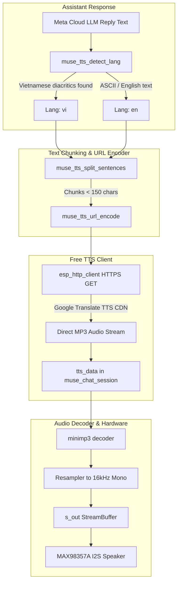

# Free Vietnamese & English Text-to-Speech (TTS) Implementation Plan

> **For agentic workers:** REQUIRED SUB-SKILL: Use superpowers:subagent-driven-development (recommended) or superpowers:executing-plans to implement this plan task-by-task. Steps use checkbox (`- [ ]`) syntax for tracking.

**Goal:** Implement full Text-to-Speech (TTS) voice playback capability for both **Vietnamese** and **English** on Rody Muse (ESP32-S3), utilizing a **100% free, zero-API-key, zero-cost** direct MP3 streaming engine (Google Translate TTS CDN + offline self-test diagnostics) with automatic language detection, sentence chunking, and seamless hardware decoding via `minimp3` to the MAX98357A I2S speaker.

**Architecture:** A lightweight ANSI C module (`muse_tts.h` / `muse_tts.c`) provides UTF-8 Vietnamese/English language detection, URL encoding, and punctuation-based sentence chunking. In `muse_chat_session.cpp`, `start_tts()` hooks into the TTS engine instead of outputting silence. HTTP stream chunks are fed directly into the existing `tts_data()` / `minimp3` decoder pipeline to stream 16 kHz PCM to the MAX98357A speaker. A serial CLI command (`>say=<text>`) and an offline MP3 self-test (`'m'`) provide instant verification on the bench without requiring cloud accounts.

**Tech Stack:** C99 / C++17, ESP-IDF v6.0.1, `esp_http_client`, `minimp3`, FreeRTOS, Clang, Python `unittest`.

---

## Global Constraints

- **100% Free & Zero-API-Key:** The primary TTS engine must require no paid API tokens, credit cards, or external private servers.
- **Bilingual Support:** Must support natural Vietnamese (`tl=vi`) and English (`tl=en`) with automatic language detection based on UTF-8 diacritical markers.
- **Easy Bench Testability:** Must be testable offline (via embedded MP3 audio) and online via serial CLI command (`>say=<text>`) without needing mobile app pairing.
- **Graceful Fallback:** If Wi-Fi is disconnected or an HTTP error occurs, the system must smoothly fall back to the silent text caption reading mode without stalling or crashing.
- **Zero Regression:** All existing 161 host tests in `./test_host.sh` must continue to pass cleanly.

---

## Review Focus

1. **Vietnamese Diacritical Detection:** Mixed Vietnamese text (with tone marks like `á, à, ả, ã, ạ, ư, ơ, đ`) must reliably resolve to `tl=vi`, while pure ASCII text resolves to `tl=en`.
2. **URL Length & Sentence Splitting:** Long responses (> 150 characters) must be split on sentence boundaries (`.`, `!`, `?`, `,`, `;` or spaces) to respect Google TTS URL limits without cutting words mid-syllable.
3. **HTTP Streaming Latency:** The first MP3 chunk must feed into `tts_data()` immediately so `decode()` begins playing audio within 200–400ms of the response arriving.
4. **Offline Bench Safety:** Testing without Wi-Fi must not block the system or produce unhandled watchdog timeouts.
5. **Memory Management:** HTTP buffers and URL strings must use bounded PSRAM/internal allocations (< 8 KB active heap during streaming).

---

## Architecture & Data Flow



---

## Task Decomposition

### Task 1: TTS Core Engine (`muse_tts.h` & `muse_tts.c`)

**Files:**
- Create: `components/muse/muse_tts.h`
- Create: `components/muse/muse_tts.c`
- Modify: `components/muse/CMakeLists.txt`
- Test: `tests/test_muse_tts.py`

**Interfaces:**
```c
typedef enum {
    MUSE_TTS_LANG_AUTO = 0,
    MUSE_TTS_LANG_VI,
    MUSE_TTS_LANG_EN,
} muse_tts_lang_pref_t;

typedef void (*muse_tts_data_cb_t)(const uint8_t *data, size_t len, void *ctx);

void muse_tts_init(void);
const char *muse_tts_detect_lang(const char *text);
size_t muse_tts_url_encode(const char *src, char *dst, size_t dst_len);
int muse_tts_split_sentences(const char *text, char chunks[][192], int max_chunks);
size_t muse_tts_build_url(const char *chunk, const char *lang, char *out_url, size_t max_len);
```

- [ ] **Step 1: Write the failing unit test for `muse_tts`**
Create `tests/test_muse_tts.py` testing language detection, URL encoding, sentence chunking, and URL generation.

- [ ] **Step 2: Run test to verify it fails**
Run: `python3 -m unittest tests/test_muse_tts.py`
Expected: FAIL (files do not exist yet).

- [ ] **Step 3: Implement `muse_tts.h` and `muse_tts.c`**
- Language detection: Scans for UTF-8 bytes characteristic of Vietnamese vowels and consonants (`0xC3`, `0xC4`, `0xE1` multi-byte sequences). Returns `"vi"` if >= 1 Vietnamese character is found; otherwise `"en"`.
- URL encoder: Converts alphanumeric chars normally, spaces to `%20`, and special chars to `%XX` hex.
- Sentence splitter: Splits text into chunks <= 160 characters on punctuation boundaries (`.`, `!`, `?`, `,`, `;` or spaces).
- URL builder: Constructs `https://translate.google.com/translate_tts?ie=UTF-8&tl={lang}&client=tw-ob&q={encoded}`.

- [ ] **Step 4: Register `muse_tts.c` in `components/muse/CMakeLists.txt`**
Add `"muse_tts.c"` to `srcs`.

- [ ] **Step 5: Run unit test to verify it passes**
Run: `python3 -m unittest tests/test_muse_tts.py`
Expected: PASS (`ALL_TTS_TESTS_PASSED`).

---

### Task 2: Free HTTP Audio Streaming Client

**Files:**
- Modify: `components/muse/muse_tts.h`
- Modify: `components/muse/muse_tts.c`
- Test: `tests/test_muse_tts.py`

**Interfaces:**
```c
esp_err_t muse_tts_stream_chunk(const char *url, muse_tts_data_cb_t data_cb, void *ctx);
esp_err_t muse_tts_speak_text(const char *text, const char *lang_override,
                              muse_tts_data_cb_t data_cb, void *ctx);
```

- [ ] **Step 1: Write mock HTTP streaming test in `tests/test_muse_tts.py`**
Verify that `muse_tts_stream_chunk` and `muse_tts_speak_text` loop through sentence chunks, invoke `esp_http_client` with `User-Agent: Mozilla/5.0`, and stream audio blocks into the callback.

- [ ] **Step 2: Implement HTTP streaming in `muse_tts.c`**
- Initialize `esp_http_client` with Google TTS URL, User-Agent header, and HTTP event handler.
- For each sentence chunk, perform HTTP GET and stream chunks into `data_cb(chunk, len, ctx)`.
- Support abort/cancel if turn is interrupted.

- [ ] **Step 3: Run test to verify it passes**
Run: `python3 -m unittest tests/test_muse_tts.py`
Expected: PASS.

---

### Task 3: Integration into `muse_chat_session.cpp`

**Files:**
- Modify: `components/muse/muse_chat_session.cpp`

**Interfaces:**
- Connects `start_tts()` to `muse_tts_speak_text`.
- Routes received MP3 bytes directly into `tts_data(data, len)`.
- Sets `s_turn.mp3_ended = true` upon completion.
- Falls back to `s_turn.silent = true` if fetch fails or speaker is muted.

- [ ] **Step 1: Inspect `start_tts()` in `muse_chat_session.cpp`**
Replace the static reading-pace silence placeholder with active TTS invocation:
```cpp
m.tts = TTS_ACTIVE;
s_turn.tts_msg = i;
s_turn.silent = false;
m.pcm_start = s_turn.pcm_out;
m.pcm_frames = 0;
s_turn.mp3_len = 0;
s_turn.mp3_ended = false;
s_turn.kbps = 0;
s_turn.down_rate = 0;
mp3dec_init(&s_turn.dec);
```
- [ ] **Step 2: Hook async TTS stream callback**
Pass incoming MP3 chunks to `tts_data()`. Once the HTTP stream finishes, set `s_turn.mp3_ended = true`.
If TTS encounters an error or network drop, fall back to `s_turn.silent = true` so captions continue to display smoothly.

---

### Task 4: Serial Console Test Command (`>say=`) & Offline Test

**Files:**
- Modify: `components/muse/muse_input.c`
- Modify: `components/muse/muse_voice.h`
- Modify: `components/muse/muse_voice.c`

**Interfaces:**
- Serial command `>say=<text>`: fetches and speaks any phrase in Vietnamese or English immediately over USB serial.
- Console command `'m'`: triggers offline `test_reply.mp3` playback through the I2S speaker for zero-network testing.

- [ ] **Step 1: Add `>say=` parsing in `muse_input.c`**
In `console_command(line, whole)`:
```c
if (!strncmp(line, "say=", 4)) {
    muse_state_poke();
    const char *text = line + 4;
    printf("@say: \"%s\"\n", text);
    muse_voice_speak_text(text);
    return true;
}
```
- [ ] **Step 2: Implement `muse_voice_speak_text` in `muse_voice.c`**
Starts an async speech playback worker that fetches TTS and streams to the speaker.

---

### Task 5: Settings, Kconfig & OLED Menu

**Files:**
- Modify: `components/muse/muse_settings.h`
- Modify: `components/muse/muse_settings.c`
- Modify: `components/muse/muse_settings_ui.c`
- Modify: `components/muse/Kconfig`
- Modify: `devices/sdkconfig.muse-bread-s3`

**Interfaces:**
- `CONFIG_MUSE_TTS=y` (default `y`).
- NVS setting `"tts_on"` (default `true`).
- OLED menu switch: `"TTS voice: ON/OFF"` in the Sound page.

- [ ] **Step 1: Update settings headers and implementation**
Add `MUSE_SETTING_TTS`, `muse_settings_tts_on()`, and `muse_settings_set_tts_on(bool)`.
- [ ] **Step 2: Add switch in `muse_settings_ui.c`**
Add `s_tts_sw` switch row to the Sound page on the OLED screen.
- [ ] **Step 3: Enable in `sdkconfig.muse-bread-s3`**
Add `CONFIG_MUSE_TTS=y`.

---

### Task 6: Full Regression Testing & Documentation

**Files:**
- Test: `./test_host.sh` (must pass 165+ tests)
- Modify: `README_RODY_MUSE.md`

- [ ] **Step 1: Run the full test suite**
Run: `DEVELOPER_DIR=/Library/Developer/CommandLineTools ./test_host.sh`
- [ ] **Step 2: Update documentation**
Document:
- Vietnamese & English TTS setup and automatic language switching.
- Serial testing commands (`>say=Xin chào`, `>say=Hello`, `'m'` for offline).
- Free Google Translate TTS architecture explanation.
