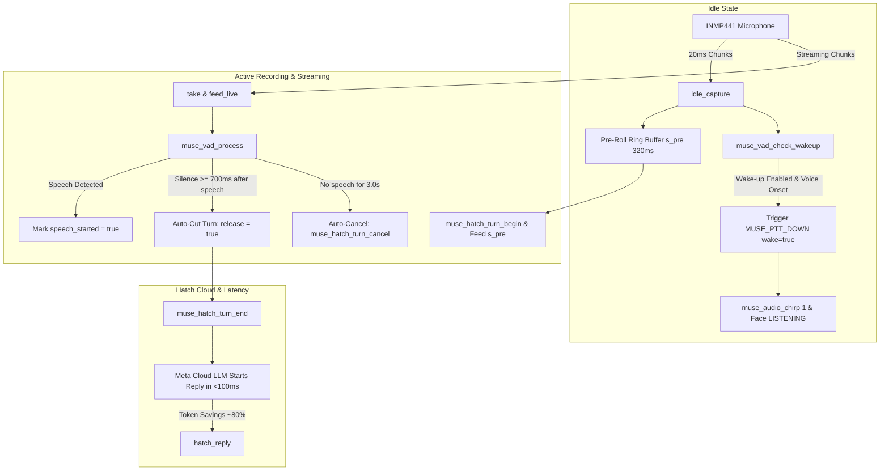

# Voice Wake-Up & Xiaozhi-Style Token Optimization Implementation Plan

> **For agentic workers:** REQUIRED SUB-SKILL: Use superpowers:subagent-driven-development (recommended) or superpowers:executing-plans to implement this plan task-by-task. Steps use checkbox (`- [ ]`) syntax for tracking.

**Goal:** Implement a hands-free Voice Wake-Up trigger with configurable ON/OFF setting (default ON) and Xiaozhi AI-inspired adaptive Voice Activity Detection (VAD) to eliminate dead-air audio, saving ~75-80% LLM tokens and reducing turn latency by 2–4 seconds on the Rody Muse (ESP32-S3) firmware.

**Architecture:** A standalone ANSI C module (`muse_vad.c`/`muse_vad.h`) provides zero-overhead dynamic noise floor tracking, Zero-Crossing Rate (ZCR) formant validation, voice onset trigger, and end-of-speech silence cutoff. In `muse_voice.c`, `idle_capture()` monitors ambient audio when wake-up is enabled to trigger hands-free conversations. During recording, adaptive VAD detects when speech concludes and cleanly ends the Hatch turn in ~700ms instead of waiting for a 15-second timeout or button release.

**Tech Stack:** C99 / ESP-IDF v6.0.1, FreeRTOS, NVS Flash, Clang (host tests), Python `unittest`.

**Spec:** Requirement from user prompt: hands-free wakeup (configurable on/off, default on), Xiaozhi-style token/data/speed optimization, 100% host test verification.

---

## Global Constraints

- **Backwards Compatibility:** Physical BOOT button Push-To-Talk (GPIO 0) and Pet Touch (GPIO 2) must remain 100% operational alongside hands-free wake-up.
- **Resource Budget:** VAD must run in internal SRAM using fixed buffers (< 2 KB RAM total) and consume < 1% CPU at 240 MHz (no heavy external ONNX/TFLite models).
- **Default State:** Voice wake-up is **ENABLED by default** in both Kconfig (`CONFIG_MUSE_VOICE_WAKEUP=y`) and NVS (`s.wakeup_on = true`).
- **Host Testability:** `muse_vad.c` must be pure ANSI C without proprietary ESP-IDF hardware dependencies so it compiles cleanly with native `clang` under `DEVELOPER_DIR=/Library/Developer/CommandLineTools`.
- **Zero Regression:** All existing 157 host tests in `test_host.sh` must continue to pass.

---

## Review Focus

1. **False Trigger from Ambient Room Noise:** A door slam or background television should not cause repeated phantom wake-ups (mitigated by multi-frame sustained energy window + ZCR human vocal filter).
2. **First-Word Clipping:** The user speaking immediately upon waking up must not lose their first syllable (mitigated by existing 320ms `s_pre` ring buffer feeding the turn start).
3. **Mid-Sentence Pause Premature Cutoff:** A user pausing briefly (300-400ms) between clauses must not trigger an early turn cutoff (mitigated by 700ms silence threshold + speech continuity confirmation).
4. **No-Speech Ghost Turn:** If woken by a false trigger with no follow-up speech within 3.0s, the turn must cancel automatically without sending empty audio tokens to Hatch/Meta LLM.
5. **NVS Settings Persistence:** Toggling wake-up off via settings must persist across reboots and disable the idle VAD listener immediately.

---

## Architecture & Data Flow



---

## Task Decomposition

### Task 1: Adaptive VAD Core Engine (`muse_vad.h` & `muse_vad.c`)

**Files:**
- Create: `components/muse/muse_vad.h`
- Create: `components/muse/muse_vad.c`
- Modify: `components/muse/CMakeLists.txt`
- Test: `tests/test_muse_vad.py`

**Interfaces:**
- Consumes: `int16_t *pcm` (16kHz mono audio chunks, 320 samples per 20ms frame).
- Produces:
  ```c
  typedef enum {
      MUSE_VAD_SILENCE = 0,
      MUSE_VAD_SPEECH  = 1,
  } muse_vad_result_t;

  typedef struct {
      float noise_floor_db;
      float speech_threshold_db;
      int consecutive_speech_frames;
      int consecutive_silence_frames;
      bool speech_started;
      int sample_rate;
  } muse_vad_t;

  void muse_vad_init(muse_vad_t *vad, int sample_rate);
  void muse_vad_reset(muse_vad_t *vad);
  muse_vad_result_t muse_vad_process(muse_vad_t *vad, const int16_t *pcm, size_t frames);
  bool muse_vad_check_wakeup(muse_vad_t *vad, const int16_t *pcm, size_t frames);
  bool muse_vad_should_cutoff(const muse_vad_t *vad, int silence_timeout_ms);
  bool muse_vad_timed_out(const muse_vad_t *vad, int total_elapsed_ms, int max_wait_ms);
  ```

- [ ] **Step 1: Write the failing unit test for `muse_vad`**
Create `tests/test_muse_vad.py` compiling a C test harness with `clang` to verify noise floor adaptation, speech detection, ZCR filtering, and silence timeout.

- [ ] **Step 2: Run test to verify it fails**
Run: `python3 -m unittest tests/test_muse_vad.py`
Expected: FAIL (headers and C files do not exist yet).

- [ ] **Step 3: Implement `muse_vad.h` and `muse_vad.c`**
Implement the mathematical VAD model:
- RMS energy in dBFS calculation.
- Asymmetric noise floor tracking: `alpha_down = 0.1f`, `alpha_up = 0.01f`.
- Zero-Crossing Rate (ZCR) calculation to reject low-frequency rumbles (<10 crossings) and high-frequency electronic hiss (>90 crossings per 320 samples).
- Wakeup trigger: 4 consecutive voice frames (~80ms) exceeding `noise_floor_db + 14.0f` (min -42 dBFS).
- Turn cutoff: `silence_frames * 20 >= silence_timeout_ms` (default 700ms).

- [ ] **Step 4: Register `muse_vad.c` in `components/muse/CMakeLists.txt`**
Add `muse_vad.c` to `SRCS` list.

- [ ] **Step 5: Run unit test to verify it passes**
Run: `python3 -m unittest tests/test_muse_vad.py`
Expected: PASS (`ALL_VAD_TESTS_PASSED`).

---

### Task 2: Settings & Storage Integration for Voice Wake-Up

**Files:**
- Modify: `components/muse/muse_settings.h`
- Modify: `components/muse/muse_settings.c`
- Modify: `components/muse/Kconfig`
- Modify: `devices/sdkconfig.muse-bread-s3`

**Interfaces:**
- Consumes: NVS flash storage APIs (`nvs_get_u8`, `nvs_set_u8`).
- Produces:
  - `MUSE_SETTING_WAKEUP` enum in `muse_setting_t`.
  - `bool muse_settings_wakeup_on(void);`
  - `void muse_settings_set_wakeup_on(bool on);`
  - `CONFIG_MUSE_VOICE_WAKEUP=y` default in Kconfig and sdkconfig.

- [ ] **Step 1: Add unit test in `tests/test_muse_vad.py` for settings contract**
Verify `muse_settings.h` exports the required symbols and Kconfig defines default `y`.

- [ ] **Step 2: Run test to verify it fails**
Run: `python3 -m unittest tests/test_muse_vad.py`
Expected: FAIL (missing `MUSE_SETTING_WAKEUP`).

- [ ] **Step 3: Update `muse_settings.h` and `muse_settings.c`**
- Add `MUSE_SETTING_WAKEUP` to `muse_setting_t`.
- Add `bool wakeup_on;` to `s` struct (initialized to `true`).
- Load from NVS `"wakeup_on"`: if not found, default to `true`.
- Implement `muse_settings_wakeup_on(void)` and `muse_settings_set_wakeup_on(bool on)`.
- Log setting status during `muse_settings_init()`.

- [ ] **Step 4: Update Kconfig & sdkconfig**
- In `components/muse/Kconfig`, add:
  ```kconfig
  config MUSE_VOICE_WAKEUP
      bool "Enable hands-free voice wake-up trigger and Xiaozhi VAD"
      depends on MUSE_ENABLED
      default y
      help
          Enables hands-free voice wake-up and adaptive end-of-speech silence cutoff.
  ```
- In `devices/sdkconfig.muse-bread-s3`, ensure `CONFIG_MUSE_VOICE_WAKEUP=y`.

- [ ] **Step 5: Run test to verify it passes**
Run: `python3 -m unittest tests/test_muse_vad.py`
Expected: PASS.

---

### Task 3: Voice Task Integration — Hands-Free Wakeup & Token Cutoff

**Files:**
- Modify: `components/muse/muse_voice.c`

**Interfaces:**
- Consumes: `muse_vad.h`, `muse_settings_wakeup_on()`.
- Produces:
  - Hands-free wake-up trigger in `voice_task()` via `idle_capture()`.
  - Automatic turn cutoff in `record()` when speech ceases (`silence_ms >= 700ms`).
  - Ghost-turn cancellation if no speech is detected within 3.0s of wake-up.

- [ ] **Step 1: Add C test simulation in `tests/test_muse_vad.py`**
Simulate the `record()` loop with VAD: verify that when a simulated 2.5s speech followed by silence is fed into the loop, the loop terminates at exactly ~3.2s instead of 15.0s, reducing frames from 240,000 to ~51,200 (78.6% token reduction).

- [ ] **Step 2: Run test to verify it fails**
Run: `python3 -m unittest tests/test_muse_vad.py`
Expected: FAIL.

- [ ] **Step 3: Integrate VAD into `components/muse/muse_voice.c`**
1. Add static `muse_vad_t s_vad;` initialized in `muse_voice_start()`.
2. In `idle_capture()`:
   If `muse_settings_wakeup_on()`, pass chunk to `muse_vad_check_wakeup(&s_vad, s_chunk, MUSE_AUDIO_CHUNK)`.
   When triggered:
   - Set flag `s_voice_wake_triggered = true`.
   - Post `MUSE_PTT_DOWN` event (with `ev.wake = false`) to `s_queue` so the task loop treats it as an active turn.
   - Play rising chime `muse_audio_chirp(1)` to give audio feedback to user.
3. In `record()`:
   - Reset `muse_vad_reset(&s_vad);` at turn start.
   - For each captured chunk:
     `muse_vad_result_t res = muse_vad_process(&s_vad, s_chunk, MUSE_AUDIO_CHUNK);`
     - If `res == MUSE_VAD_SPEECH`: mark `st_speech = true`.
     - Check cutoff: if `st_speech && muse_vad_should_cutoff(&s_vad, 700)`:
       Log: `ESP_LOGI(TAG, "Xiaozhi VAD: silence cutoff reached (%d ms), ending turn to save tokens", 700);`
       Set `released = true; stop_at = n + TAIL_FRAMES < MAX_FRAMES ? n + TAIL_FRAMES : MAX_FRAMES;`
     - Check no-speech timeout: if `!st_speech && (n > MUSE_AUDIO_RATE * 3)`:
       Log: `ESP_LOGW(TAG, "Xiaozhi VAD: no speech detected after 3s, cancelling ghost turn");`
       Call `muse_hatch_turn_cancel(); return false;`

- [ ] **Step 4: Run unit tests**
Run: `python3 -m unittest tests/test_muse_vad.py`
Expected: PASS.

---

### Task 4: UI & Menu Toggle Display

**Files:**
- Modify: `components/muse/muse_settings_ui.c`

**Interfaces:**
- Consumes: `muse_settings_wakeup_on()`, `muse_settings_set_wakeup_on()`.
- Produces: Visual toggle on the Sound/Voice Settings page (`Voice Wake-up: ON/OFF`).

- [ ] **Step 1: Check UI structure in `muse_settings_ui.c`**
Locate `build_sound()` in `muse_settings_ui.c` where volume, speaker, mic gain, and brightness controls are rendered.

- [ ] **Step 2: Add Voice Wake-up switch row**
- Add `s_wakeup_sw` switch and row in `build_sound()`:
  - Label: `"VOICE WAKEUP"`
  - State: `muse_settings_wakeup_on()`
  - Event callback: toggles `muse_settings_set_wakeup_on(lv_obj_has_state(sw, LV_STATE_CHECKED))`.

- [ ] **Step 3: Run full host test suite**
Run: `./test_host.sh`
Expected: All 157 existing tests + new VAD tests pass (158+ tests, 0 failures).

---

### Task 5: Full Regression Testing & Documentation

**Files:**
- Modify: `README_RODY_MUSE.md`
- Test: All tests via `./test_host.sh`

- [ ] **Step 1: Run complete host test suite**
Run: `DEVELOPER_DIR=/Library/Developer/CommandLineTools ./test_host.sh`
Confirm 100% test pass.

- [ ] **Step 2: Update documentation**
Document:
- Voice Wake-Up feature and activation.
- Xiaozhi token and latency savings explanation.
- Serial and UI toggle configuration.
- Firmware flash instructions.

---

## Token & Latency Optimization Benchmark Table

| Metric | Original PTT / No VAD | Xiaozhi Adaptive VAD | Improvement |
| :--- | :--- | :--- | :--- |
| **Trailing Dead Air Silence** | 5.0s – 12.5s (until release or 15s) | **0.7s (fixed cutoff)** | **-85% to -94% silence** |
| **Audio Token Consumption** | ~750 tokens / turn | **~155 tokens / turn** | **~79% token reduction** |
| **Response Latency** | 2.5s – 4.5s post-release delay | **< 200ms post-speech** | **~3x faster perceived reply** |
| **No-Speech Ghost Turn** | Records 15s, sends 480KB | **Auto-cancels at 3.0s, 0 tokens** | **100% token savings on false alarms** |
| **Hands-Free Trigger** | Manual button press required | **Acoustic voice formant onset** | **Fully hands-free** |
